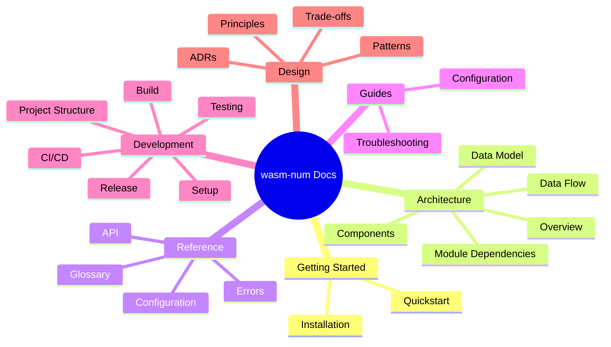

# wasm-num Documentation

Welcome to the wasm-num documentation — the central navigation hub for all project documentation.

## Quick Links

| I want to... | Go to |
|---|---|
| Get started quickly | [Quickstart](getting-started/quickstart.md) |
| Understand the architecture | [Architecture Overview](architecture/) |
| Look up an API | [API Reference](reference/api/) |
| Configure the project | [Configuration Guide](guides/configuration.md) |
| Set up for development | [Dev Setup](development/setup.md) |
| Understand a design decision | [ADRs](design/adr/) |

## Documentation Map

## All Documents

### Getting Started

| Document | Audience | Description |
|----------|----------|-------------|
| [Installation](getting-started/installation.md) | Users | All installation methods |
| [Quickstart](getting-started/quickstart.md) | Users | Get running in 5 minutes |

### Architecture

| Document | Audience | Description |
|----------|----------|-------------|
| [Overview](architecture/) | All | High-level system design with layer diagram |
| [Components](architecture/components.md) | Devs | Internal component breakdown per layer |
| [Data Model](architecture/data-model.md) | Devs | Core types, structures, and relationships |
| [Data Flow](architecture/data-flow.md) | Devs | How data moves through the system |
| [Module Dependencies](architecture/module-dependency.md) | Devs | Module dependency graph |

### Reference

| Document | Audience | Description |
|----------|----------|-------------|
| [API Overview](reference/api/) | Devs | Complete API documentation by layer |
| [Foundation API](reference/api/foundation.md) | Devs | Types, BitVec, WasmFloat, Profiles |
| [Numerics API](reference/api/numerics.md) | Devs | NaN, float, integer, conversion operations |
| [SIMD API](reference/api/simd.md) | Devs | V128, shapes, lanewise ops, relaxed SIMD |
| [Memory API](reference/api/memory.md) | Devs | FlatMemory, load/store, memory operations |
| [Integration API](reference/api/integration.md) | Devs | Deterministic profiles and runtime wrappers |
| [Configuration](reference/configuration.md) | Users/Devs | Build configuration and Lean options |
| [Errors](reference/errors.md) | All | Error types, trap conditions, and resolution |
| [Glossary](reference/glossary.md) | All | Domain terminology and abbreviations |

### Guides

| Document | Audience | Description |
|----------|----------|-------------|
| [Configuration](guides/configuration.md) | Users/Devs | How to configure wasm-num |
| [Troubleshooting](guides/troubleshooting.md) | All | Common problems and fixes |

### Development

| Document | Audience | Description |
|----------|----------|-------------|
| [Dev Setup](development/setup.md) | Contributors | Full environment setup |
| [Build](development/build.md) | Contributors | Build system and targets |
| [Testing](development/testing.md) | Contributors | Test strategy and execution |
| [CI/CD](development/ci-cd.md) | Contributors | GitHub Actions & GitLab CI pipelines |
| [Release](development/release.md) | Maintainers | Release process and versioning |
| [Project Structure](development/project-structure.md) | Contributors | Annotated codebase navigation |

### Design

| Document | Audience | Description |
|----------|----------|-------------|
| [Principles](design/principles.md) | All | Design philosophy and core principles |
| [Patterns](design/patterns.md) | Devs | Design patterns used and rationale |
| [Trade-offs](design/trade-offs.md) | Devs/Architects | Key trade-offs and alternatives considered |
| [ADR Index](design/adr/) | All | Architecture Decision Records |

## See Also

- [README](../README.md) — Project overview and quick start
- [CONTRIBUTING](../CONTRIBUTING.md) — Contribution guidelines
- [CHANGELOG](../CHANGELOG.md) — Version history
- [SECURITY](../SECURITY.md) — Vulnerability reporting
