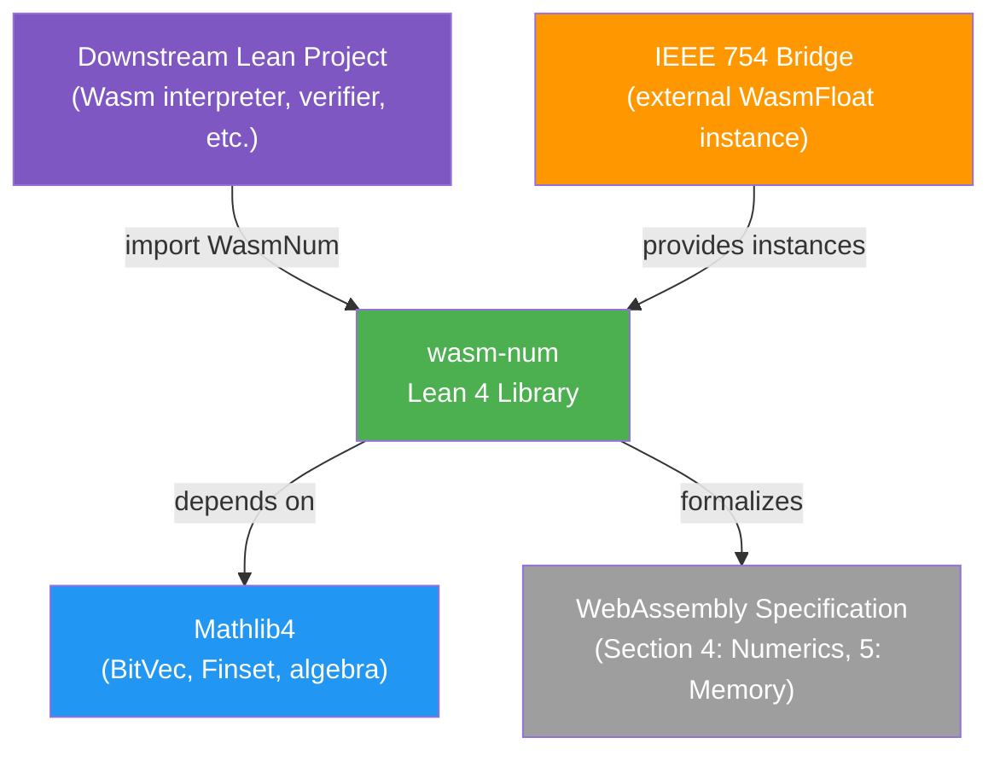
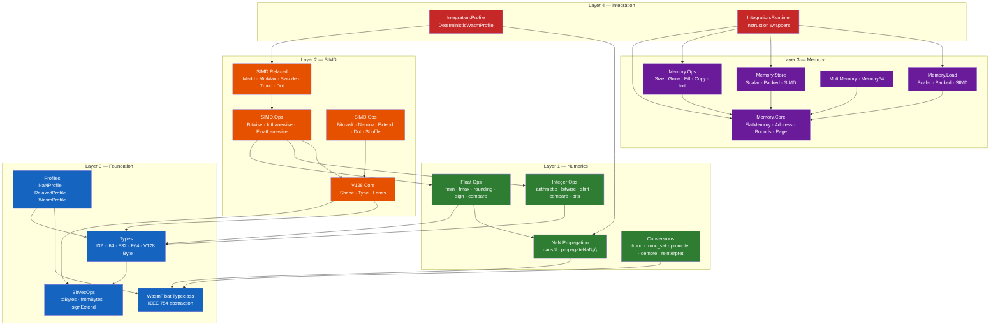

# Architecture Overview

> **Audience**: Developers, Architects, Contributors

wasm-num is a formally verified Lean 4 formalization of the WebAssembly numeric layer. It covers integer/float operations, type conversions, 128-bit SIMD (including relaxed SIMD), and linear memory, all backed by machine-checked proofs.

## System Context

wasm-num is a pure Lean 4 library — it has no runtime, no I/O, and no C FFI. It is consumed by downstream Lean projects that need verified WebAssembly numeric semantics.

## Layered Architecture

wasm-num uses a strict layered architecture with **no circular dependencies**. Higher layers import lower layers; never the reverse.

## Key Design Decisions

| Decision | Summary | ADR |
|----------|---------|-----|
| IEEE 754 Independence | `WasmFloat` typeclass decouples from any specific float library | [ADR-001](../design/adr/0001-typeclass-mediated-754-independence.md) |
| BitVec Universal Representation | All numeric types (`I32`, `F32`, `V128`, etc.) are `BitVec N` | [ADR-002](../design/adr/0002-bitvec-universal-representation.md) |
| Non-determinism as Sets | Spec-level non-determinism modeled as `Set α` | [ADR-003](../design/adr/0003-nondeterminism-as-sets.md) |
| V128 Shape System | Compile-time proofs ensure lane width × count = 128 | [ADR-004](../design/adr/0004-v128-shape-system.md) |
| Parameterized Address Width | `FlatMemory addrWidth` supports both Memory32 and Memory64 | [ADR-005](../design/adr/0005-flatmemory-parameterized-address-width.md) |
| Proof Separation | Definitions in `WasmNum/`, proofs in `WasmNum/Proofs/` | [ADR-006](../design/adr/0006-proof-separation.md) |
| No C FFI | Everything is pure Lean — no foreign function interface | [ADR-007](../design/adr/0007-no-c-ffi.md) |

## Component Index

| Component | Location | Responsibility |
|-----------|----------|---------------|
| Types | `WasmNum/Foundation/Types.lean` | Core type aliases (`I32`, `I64`, `F32`, `F64`, `V128`, `Byte`) |
| BitVecOps | `WasmNum/Foundation/BitVec.lean` | Byte extraction, endianness, sign/zero extension |
| WasmFloat | `WasmNum/Foundation/WasmFloat.lean` | IEEE 754 typeclass abstraction |
| Profiles | `WasmNum/Foundation/Profile.lean` | NaN and relaxed SIMD non-determinism selectors |
| NaN | `WasmNum/Numerics/NaN/` | NaN propagation sets and deterministic specialization |
| Float Ops | `WasmNum/Numerics/Float/` | fmin, fmax, rounding, sign, comparisons |
| Integer Ops | `WasmNum/Numerics/Integer/` | Arithmetic, bitwise, shifts, comparisons, saturating |
| Conversions | `WasmNum/Numerics/Conversion/` | trunc, trunc_sat, promote, demote, reinterpret, extend |
| V128 Core | `WasmNum/SIMD/V128/` | Shape system, lane access, splat, mapLanes, zipLanes |
| SIMD Ops | `WasmNum/SIMD/Ops/` | Bitwise, integer/float lanewise, bitmask, narrow, extend, dot |
| Relaxed SIMD | `WasmNum/SIMD/Relaxed/` | Non-deterministic relaxed SIMD operations |
| Memory Core | `WasmNum/Memory/Core/` | FlatMemory, page model, address calculation, bounds |
| Load/Store | `WasmNum/Memory/Load/`, `Store/` | Scalar, packed, and SIMD memory access |
| Memory Ops | `WasmNum/Memory/Ops/` | size, grow, fill, copy, init, data.drop |
| MultiMemory | `WasmNum/Memory/MultiMemory.lean` | Multi-memory store with 32/64-bit instances |
| Integration | `WasmNum/Integration/` | Deterministic profiles and instruction-level runtime wrappers |
| Proofs | `WasmNum/Proofs/` | Machine-checked proofs (parallel hierarchy to definitions) |

## Related Documents

- [Component Details](components.md)
- [Module Dependencies](module-dependency.md)
- [Data Model](data-model.md)
- [Data Flow](data-flow.md)
- [Design Principles](../design/principles.md)
- [API Reference](../reference/api/)
