# Component Details

> **Audience**: Developers, Contributors

This document breaks down every major component of wasm-num, organized by architectural layer.

## Component Architecture

```mermaid
graph TD
    subgraph "Integration Layer"
        DWP["DeterministicWasmProfile<br/>Proof-carrying profile"]
        RT["Runtime<br/>Instruction wrappers"]
    end

    subgraph "Memory Layer"
        subgraph "Memory Core"
            FM["FlatMemory<br/>ByteArray + invariants"]
            Page["Page Model<br/>pageSize · maxPages"]
            Addr["Address<br/>effectiveAddr"]
            Bnd["Bounds<br/>inBounds · inBoundsB"]
        end
        subgraph "Memory Access"
            LSc["Load.Scalar<br/>i32Load · i64Load · f32Load · f64Load"]
            LPk["Load.Packed<br/>i32Load8S/U · i64Load32S/U ..."]
            LSi["Load.SIMD<br/>v128Load · loadSplat · loadLane"]
            SSc["Store.Scalar<br/>i32Store · i64Store ..."]
            SPk["Store.Packed<br/>i32Store8 · i64Store32 ..."]
            SSi["Store.SIMD<br/>v128Store · storeLane"]
        end
        subgraph "Memory Operations"
            Size["Size<br/>memorySize"]
            Grow["Grow<br/>growSpec · GrowthPolicy"]
            Fill["Fill<br/>memory.fill"]
            Copy["Copy<br/>memory.copy (overlap-safe)"]
            Init["Init<br/>memory.init"]
            DD["DataDrop<br/>DataSegment"]
        end
        MM["MultiMemory<br/>MemoryStore · MemoryInstance"]
        M64["Memory64<br/>64-bit address support"]
    end

    subgraph "SIMD Layer"
        subgraph "V128 Core"
            Shape["Shape<br/>laneWidth × laneCount = 128"]
            V128T["V128 Type<br/>BitVec 128"]
            Lanes["Lanes<br/>lane · replaceLane · ofLanes · splat"]
        end
        subgraph "SIMD Operations"
            BW["Bitwise<br/>v128.not · and · or · xor · bitselect"]
            IL["IntLanewise<br/>add · sub · mul · shift · compare"]
            FL["FloatLanewise<br/>fadd · fmul · fmin · fmax (Set)"]
            BM["Bitmask<br/>allTrue · bitmask"]
            NR["Narrow · Extend<br/>narrowS/U · extendLow/High"]
            Dot["Dot · Swizzle · Shuffle"]
            SE["SplatExtractReplace"]
            CV["Convert<br/>SIMD conversions"]
        end
        subgraph "Relaxed SIMD"
            RM["Madd · Nmadd<br/>relaxed FMA"]
            RMM["MinMax<br/>relaxed min/max"]
            RSw["Swizzle · Trunc"]
            RLS["Laneselect · Dot · Q15"]
        end
    end

    subgraph "Numerics Layer"
        subgraph "NaN"
            NP["Propagation<br/>nansN · propagateNaN₁/₂"]
            ND["Deterministic<br/>propagateNaN₁/₂_det"]
        end
        subgraph "Float"
            FMM["MinMax<br/>fmin · fmax (Set)"]
            FR["Rounding<br/>fnearest · fceil · ffloor · ftrunc"]
            FS["Sign<br/>fabs · fneg · fcopysign"]
            FC["Compare<br/>feq · flt · fgt · fle · fge · fne"]
            FP["PseudoMinMax<br/>fpmin · fpmax"]
        end
        subgraph "Integer"
            IA["Arithmetic<br/>iadd · isub · imul · idiv · irem"]
            IBW["Bitwise<br/>iand · ior · ixor · inot · iandnot"]
            IS["Shift<br/>ishl · ishr_u/s · irotl · irotr"]
            IC["Compare<br/>ieqz · ieq · ilt · igt · ile · ige"]
            IB["Bits<br/>iclz · ictz · ipopcnt"]
            IE["Ext · Saturating · MinMax · Misc"]
        end
        subgraph "Conversion"
            TP["TruncPartial<br/>trunc (trapping)"]
            TS["TruncSat<br/>trunc_sat (saturating)"]
            PD["PromoteDemote<br/>promote · demote"]
            CIF["ConvertIntFloat<br/>convert (int→float)"]
            RI["Reinterpret<br/>identity conversions"]
            IW["IntWidth<br/>wrap · extend"]
        end
    end

    subgraph "Foundation Layer"
        Ty["Types<br/>I32 · I64 · F32 · F64 · V128 · Byte"]
        BV["BitVecOps<br/>toBytes · fromBytes · signExtend"]
        WF["WasmFloat Typeclass<br/>IEEE 754 abstraction"]
        Prof["Profiles<br/>NaNProfile · RelaxedProfile · WasmProfile"]
    end

    DWP --> NP
    DWP --> RM
    RT --> LSc
    RT --> SSc
    RT --> Grow

    LSc --> FM
    LSc --> Bnd
    LPk --> FM
    LSi --> FM
    SSc --> FM
    SPk --> FM
    SSi --> FM
    Fill --> FM
    Copy --> FM
    Init --> FM
    Grow --> FM
    Size --> FM
    MM --> FM

    IL --> Lanes
    FL --> Lanes
    BW --> V128T
    NR --> Lanes
    Dot --> Lanes
    RM --> FL
    RMM --> FL

    NP --> WF
    FMM --> NP
    FC --> WF
    TP --> WF
    TS --> WF
    PD --> WF
    CIF --> WF
    IA --> Ty
    Shape --> Ty

    style Ty fill:#1565C0,color:white
    style BV fill:#1565C0,color:white
    style WF fill:#1565C0,color:white
    style Prof fill:#1565C0,color:white
```

## Layer 0: Foundation

### Types (`WasmNum/Foundation/Types.lean`)

All WebAssembly numeric types are aliases for `BitVec N`:

| Type | Definition | Wasm Type |
|------|-----------|-----------|
| `I32` | `BitVec 32` | `i32` |
| `I64` | `BitVec 64` | `i64` |
| `F32` | `BitVec 32` | `f32` (bit-pattern) |
| `F64` | `BitVec 64` | `f64` (bit-pattern) |
| `V128` | `BitVec 128` | `v128` |
| `Byte` | `BitVec 8` | byte |
| `Addr32` | `BitVec 32` | Memory32 address |
| `Addr64` | `BitVec 64` | Memory64 address |

This is ADR-002: using `BitVec N` as the universal representation eliminates conversion overhead between integer and float representations (they share the same underlying bits).

### BitVecOps (`WasmNum/Foundation/BitVec.lean`)

WebAssembly-specific BitVec extensions in namespace `BitVecOps`:

- `getByte` — extract the i-th byte (little-endian, LSB = byte 0)
- `toLittleEndian` / `fromLittleEndian` — decompose/recompose as `Vector Byte`
- `toBytes` / `fromBytes` — aliases (Wasm is always little-endian)
- `signExtend` / `zeroExtend` — width extension with proof of width constraint
- `extractBits` — extract a range of bits
- `concat` — wrapper for `BitVec.append`

### WasmFloat (`WasmNum/Foundation/WasmFloat.lean`)

The `WasmFloat N` typeclass abstracts over any IEEE 754 implementation (ADR-001). It defines:

- **Classification**: `isNaN`, `isInfinite`, `isZero`, `isNegative`, `isSubnormal`, `isCanonicalNaN`, `isArithmeticNaN`
- **Arithmetic**: `add`, `sub`, `mul`, `div`, `sqrt`, `fma` (round-to-nearest, ties-to-even)
- **Rounding**: `nearestInt`, `ceilInt`, `floorInt`, `truncInt`
- **Comparison**: `lt`, `le`, `eq` (NaN compares unordered; +0 == -0)
- **Conversion**: `truncToInt`, `truncToNat`, `convertFromInt`, `convertFromNat`
- **Structural proofs**: `isNaN_canonicalNaN`, `isCanonicalNaN_isNaN`, `isArithmeticNaN_isNaN`

Companion typeclasses: `WasmFloatPromote` (f32 → f64, exact) and `WasmFloatDemote` (f64 → f32, may round).

A testing stub `WasmFloat/Default.lean` provides instances with correct classification but placeholder arithmetic (returns canonical NaN).

### Profiles (`WasmNum/Foundation/Profile.lean`)

Structures that parameterize non-deterministic behavior:

- **`NaNProfile`** — `selectNaN` selector with proof it returns a valid NaN
- **`RelaxedProfile`** — deterministic implementations for all relaxed SIMD operations
- **`WasmProfile`** — bundles `NaNProfile + RelaxedProfile`

## Layer 1: Numerics

### NaN Propagation (`WasmNum/Numerics/NaN/`)

Implements the Wasm spec's `nans_N{z*}` notation:

- `nans N` — all NaN values for bit width N
- `canonicalNans N` — canonical NaN set (±)
- `arithmeticNans N` — quiet NaN set
- `nansN N inputs` — spec-allowed NaN results given input operands
- `propagateNaN₁` / `propagateNaN₂` — unary/binary NaN propagation returning `Set`
- `propagateNaN₁_det` / `propagateNaN₂_det` — deterministic variants using `NaNProfile`

### Float Operations (`WasmNum/Numerics/Float/`)

| Module | Functions | Returns |
|--------|-----------|---------|
| MinMax | `fmin`, `fmax` | `Set` (NaN non-determinism) |
| Rounding | `fnearest`, `fceil`, `ffloor`, `ftrunc` | `Set` |
| Sign | `fabs`, `fneg`, `fcopysign` | deterministic `BitVec N` |
| Compare | `feq`, `fne`, `flt`, `fgt`, `fle`, `fge` | `I32` (0 or 1) |
| PseudoMinMax | `fpmin`, `fpmax` | deterministic `BitVec N` |

### Integer Operations (`WasmNum/Numerics/Integer/`)

| Module | Functions |
|--------|-----------|
| Arithmetic | `iadd`, `isub`, `imul`, `idiv_u/s` (Option), `irem_u/s` (Option) |
| Bitwise | `iand`, `ior`, `ixor`, `inot`, `iandnot` |
| Shift | `ishl`, `ishr_u`, `ishr_s`, `irotl`, `irotr` |
| Compare | `ieqz`, `ieq`, `ine`, `ilt_u/s`, `igt_u/s`, `ile_u/s`, `ige_u/s` |
| Bits | `iclz`, `ictz`, `ipopcnt` |
| Ext | `iextend_s` (sign-extend sub-width) |
| Saturating | `sat_s/u`, `iadd_sat_s/u`, `isub_sat_s/u` |
| MinMax | `imin_u/s`, `imax_u/s` |
| Misc | `iabs`, `ineg`, `iavgr_u`, `iq15mulr_sat_s` |
| Bitselect | `ibitselect` |

### Conversions (`WasmNum/Numerics/Conversion/`)

| Module | Functions | Behavior |
|--------|-----------|----------|
| TruncPartial | `truncToIntS/U`, 8 concrete variants | `Option` — `none` on NaN/Inf/overflow |
| TruncSat | `truncSatToIntS/U`, 8 concrete variants | Saturating — NaN→0, clamp to range |
| PromoteDemote | `promoteF32`, `demoteF64` | `Set` (NaN handling) |
| ConvertIntFloat | 8 `convert*` variants | Deterministic (round ties-to-even) |
| Reinterpret | 4 `reinterpret*` variants | Identity (BitVec = BitVec) |
| IntWidth | `wrapI64`, `extendI32S/U`, sub-width extends | Deterministic bit manipulation |

## Layer 2: SIMD

### V128 Core (`WasmNum/SIMD/V128/`)

- **Shape** — `laneWidth × laneCount = 128` with proof. 6 concrete shapes: `i8x16`, `i16x8`, `i32x4`, `i64x2`, `f32x4`, `f64x2`
- **Type** — `V128 := BitVec 128`
- **Lanes** — `lane`, `replaceLane`, `ofLanes`, `splat`, `mapLanes`, `zipLanes`, constants (`V128.zero`, `V128.allOnes`)

### SIMD Ops (`WasmNum/SIMD/Ops/`)

| Module | Operations |
|--------|-----------|
| Bitwise | `v128_not/and/andnot/or/xor/bitselect/any_true`, `boolToMask` |
| IntLanewise | Arithmetic, saturating, min/max, shifts, comparisons, abs, avgRU, popcnt, q15mulrSatS |
| FloatLanewise | `fadd/fsub/fmul/fdiv/fsqrt` (Set), fmin/fmax (Set), pmin/pmax, rounding (Set), abs/neg, comparisons |
| Bitmask | `allTrue`, `bitmask` |
| Narrow | `narrowS/U` (saturation) |
| Extend | `extendLow/HighS/U`, `extAddPairwiseS/U`, `extMulS/U` |
| Dot | `dot_i16x8_i32x4` |
| Swizzle | `swizzle` (lane selection by index) |
| Shuffle | `shuffle` (from two V128 vectors) |
| SplatExtractReplace | Per-shape splat, extractLane, replaceLane |
| Convert | `convertI32x4`, `truncSatF32x4S/U`, `truncSatF64x2S/U`, `promoteF32x4`, `demoteF64x2` |

### Relaxed SIMD (`WasmNum/SIMD/Relaxed/`)

All return `Set V128` — the spec permits non-deterministic results:

| Module | Operations |
|--------|-----------|
| Madd | `madd`, `nmadd` (fused multiply-add) |
| MinMax | `min`, `max` (relaxed float min/max) |
| Swizzle | `swizzle` (out-of-bounds may zero or saturate) |
| Trunc | `truncF32x4S/U`, `truncF64x2SZero/UZero` |
| Laneselect | `laneselect` (MSB-based or bitwise selection) |
| Dot | `dot_i8x16_i7x16_s`, `dot_i8x16_i7x16_add_s` |
| Q15 | `q15mulrS` |

## Layer 3: Memory

### Memory Core (`WasmNum/Memory/Core/`)

- **Page** — `pageSize = 65536`, `maxPages 32 = 65536`, `maxPages 64 = 2^48`
- **FlatMemory** — `data : ByteArray` + `pageCount` + `maxLimit` + 4 invariants
- **Address** — `effectiveAddr` (base + offset with overflow checking → `Option`)
- **Bounds** — `inBounds` (predicate), `inBoundsB` (decidable), `effectiveInBounds`

### Load/Store (`WasmNum/Memory/Load/`, `Store/`)

Scalar loads (i32/i64/f32/f64), packed loads with sign/zero extension (8/16/32-bit sub-widths), SIMD loads (v128, splat, lane, extend), and corresponding stores.

### Memory Operations (`WasmNum/Memory/Ops/`)

- `memorySize` — current page count
- `growSpec` — returns `Set GrowResult` (non-deterministic); `GrowthPolicy` typeclass for deterministic instantiation
- `fill` — fill bytes with value, traps if OOB
- `copy` — overlap-safe copy (chooses direction automatically)
- `init` — copy from data segment to memory
- `dataDrop` / `DataSegment` — drop data segments

### MultiMemory (`WasmNum/Memory/MultiMemory.lean`)

`MemoryStore` — array of `MemoryInstance` (either `mem32` or `mem64`), indexed access.

## Layer 4: Integration

### DeterministicWasmProfile (`WasmNum/Integration/Profile.lean`)

Extends `WasmProfile` with proofs that every deterministic choice belongs to the spec-allowed set. Each relaxed SIMD operation and NaN selection carries a membership proof.

### Runtime (`WasmNum/Integration/Runtime.lean`)

Deterministic instruction-level wrappers combining:
1. Effective address calculation
2. Bounds checking
3. Load/store execution

Covers all scalar/packed/SIMD load and store instructions plus memory.grow/size/fill/copy/init.

## Proofs

| Component | Proof Modules | Key Results |
|-----------|---------------|-------------|
| NaN | Propagation, Deterministic | NaN propagation correctness, deterministic singleton |
| Float | MinMax | fmin/fmax spec compliance |
| Conversion | TruncPartial, TruncSat | Range correctness, saturation correctness |
| V128 | LanesRoundtrip, LanesBijection | Lane extraction/replacement roundtrip, bijection |
| SIMD Ops | Lanewise | Lanewise operation = per-lane scalar operation |
| Relaxed | DetIsSpecialCase | Deterministic ⊆ non-deterministic |
| Memory | Bounds, LoadStore, Grow, Fill, Copy | Load-store roundtrip, disjointness, data preservation, overlap correctness |

## Related Documents

- [Architecture Overview](README.md)
- [Module Dependencies](module-dependency.md)
- [Data Model](data-model.md)
- [Data Flow](data-flow.md)
- [Design Principles](../design/principles.md)
