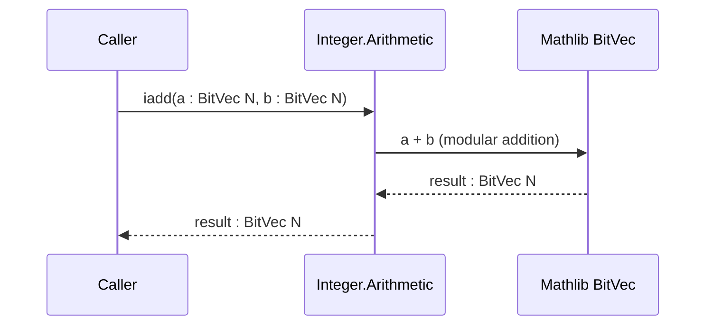
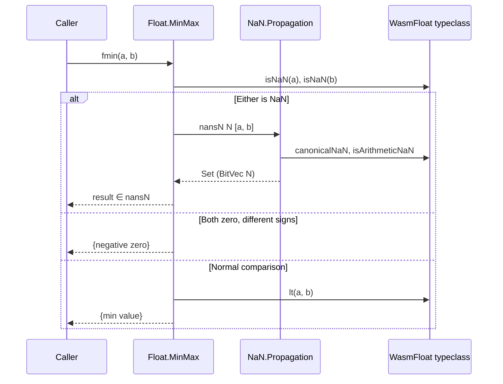
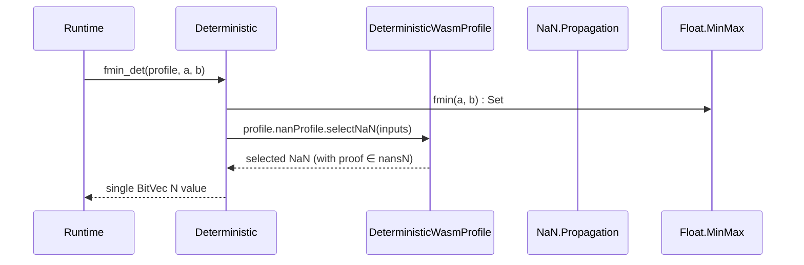
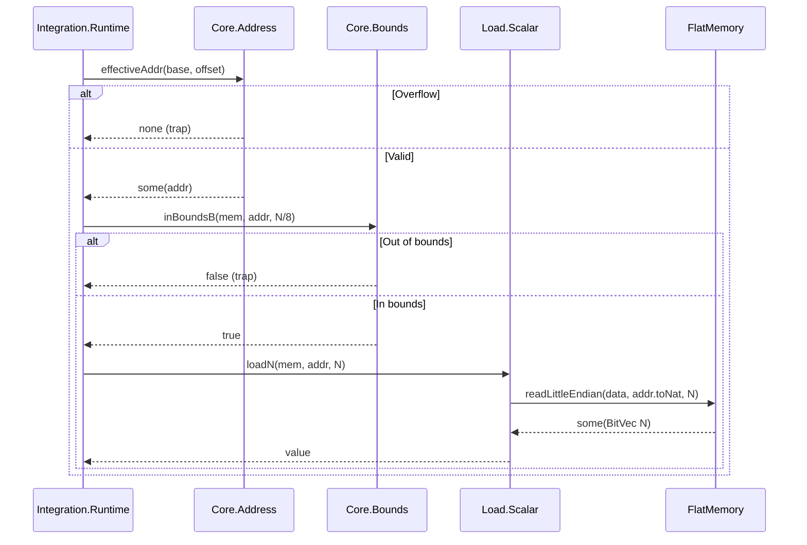
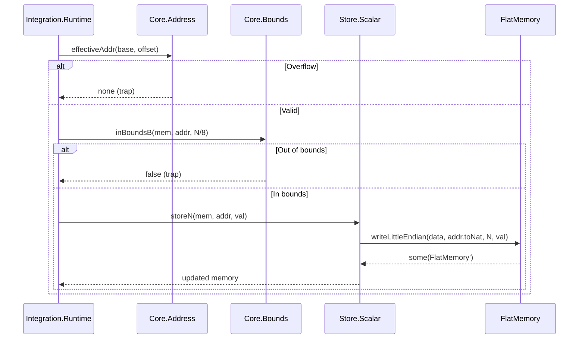
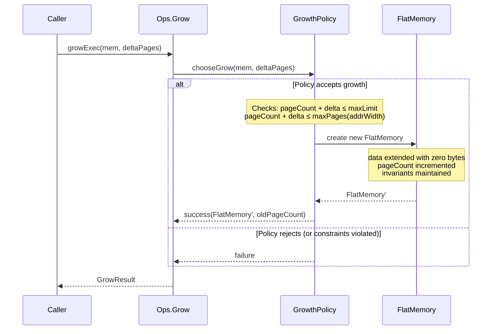
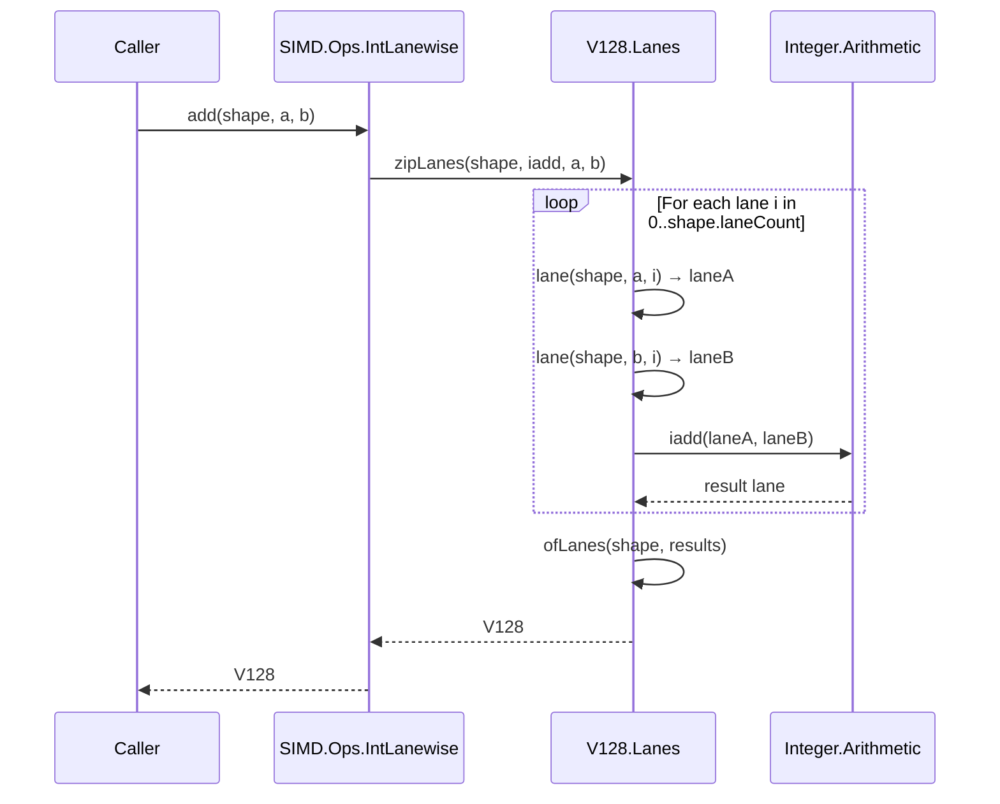
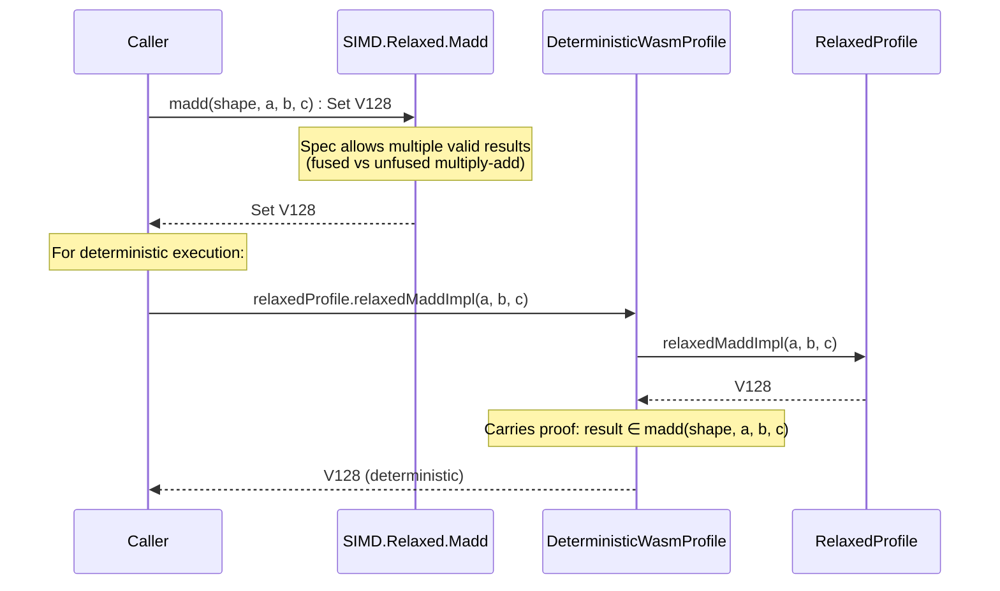
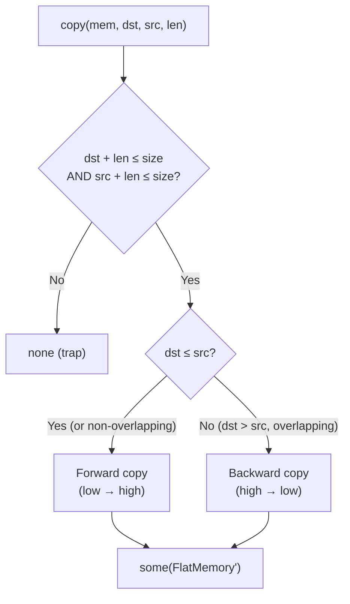

# Data Flow

> **Audience**: Developers, Contributors

This document describes how data flows through the wasm-num system for key operations.

## Scalar Integer Operation (e.g. `iadd`)

Scalar integer operations are direct functions on `BitVec N`:

No NaN propagation, no non-determinism. `Option` return for trapping operations (`idiv_u`, `idiv_s`, `irem_u`, `irem_s` — returns `none` on division by zero or signed overflow).

## Float Operation with NaN Propagation (e.g. `fmin`)

Non-deterministic float operations return `Set (BitVec N)`:

## Deterministic NaN Resolution

The integration layer narrows `Set` to a single value:

## Memory Load (Scalar)

## Memory Store (Scalar)

## Memory Grow

## SIMD Lanewise Operation

## Relaxed SIMD Resolution

## Memory Copy (Overlap Handling)

## Related Documents

- [Architecture Overview](README.md)
- [Components](components.md)
- [Data Model](data-model.md)
- [Memory API](../reference/api/memory.md)
- [Numerics API](../reference/api/numerics.md)
