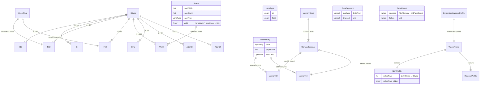
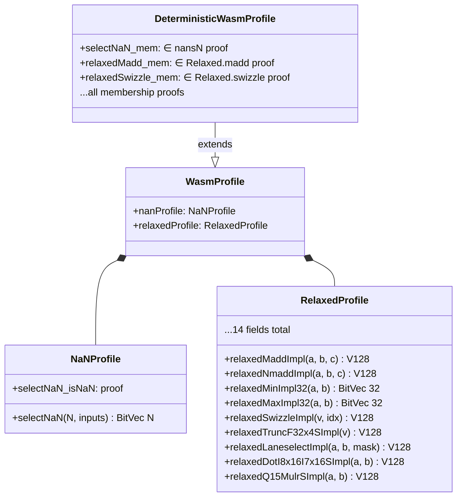
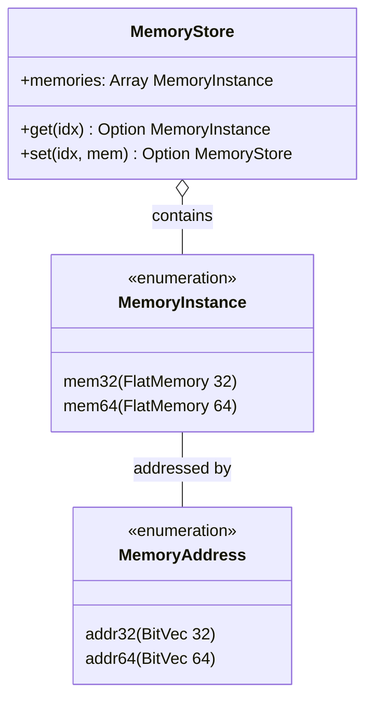

# Data Model

> **Audience**: Developers, Contributors

This document describes the core data types, structures, and their relationships in wasm-num.

## Type Universe

All WebAssembly numeric values are represented as `BitVec N` from Mathlib. This is ADR-002.



## Core Type Aliases

All defined in `WasmNum/Foundation/Types.lean`:

```lean
abbrev I32   := BitVec 32    -- WebAssembly 32-bit integer
abbrev I64   := BitVec 64    -- WebAssembly 64-bit integer
abbrev F32   := BitVec 32    -- 32-bit float (bit-pattern)
abbrev F64   := BitVec 64    -- 64-bit float (bit-pattern)
abbrev V128  := BitVec 128   -- 128-bit SIMD vector
abbrev Byte  := BitVec 8     -- 8-bit value
abbrev Addr32 := BitVec 32   -- 32-bit memory address
abbrev Addr64 := BitVec 64   -- 64-bit memory address
```

> **Note:** `F32` and `I32` are the **same type** (`BitVec 32`). Interpretation as float vs. integer depends on which operations are applied. This matches Wasm's stack machine semantics.

## SIMD Shapes

The `Shape` structure constrains lane configurations with type-level proofs:

| Shape | Lane Width | Lane Count | Lane Type |
|-------|:----------:|:----------:|-----------|
| `i8x16` | 8 | 16 | int |
| `i16x8` | 16 | 8 | int |
| `i32x4` | 32 | 4 | int |
| `i64x2` | 64 | 2 | int |
| `f32x4` | 32 | 4 | float |
| `f64x2` | 64 | 2 | float |

Each shape carries proofs:
- `valid : laneWidth * laneCount = 128`
- `widthPow2 : ∃ k, laneWidth = 2 ^ k ∧ 3 ≤ k ∧ k ≤ 6`

## FlatMemory

The central memory structure, parameterized by address width:

```lean
structure FlatMemory (addrWidth : Nat) where
  data       : ByteArray
  pageCount  : Nat
  maxLimit   : Option Nat
  -- Invariants:
  inv_dataSize : data.size = pageCount * pageSize
  inv_maxValid : ∀ max, maxLimit = some max → pageCount ≤ max
  inv_addrFits : pageCount * pageSize ≤ 2 ^ addrWidth
  inv_maxFits  : ∀ max, maxLimit = some max → max * pageSize ≤ 2 ^ addrWidth
```

| Alias | Definition | Max Memory |
|-------|-----------|------------|
| `Memory32` | `FlatMemory 32` | 4 GiB (65536 pages) |
| `Memory64` | `FlatMemory 64` | 16 EiB (2^48 pages) |

## Profile Hierarchy



## MultiMemory



## Related Documents

- [Architecture Overview](README.md)
- [Components](components.md)
- [Foundation API](../reference/api/foundation.md)
- [Memory API](../reference/api/memory.md)
- [Glossary](../reference/glossary.md)
