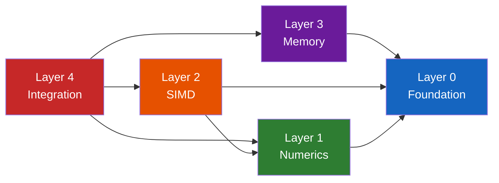
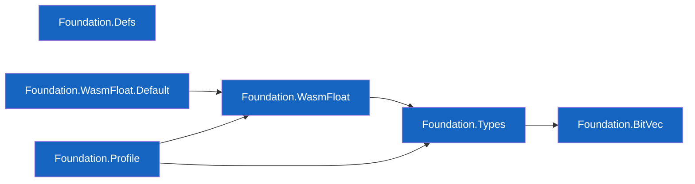
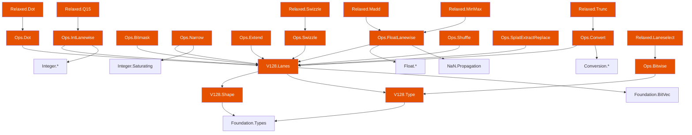
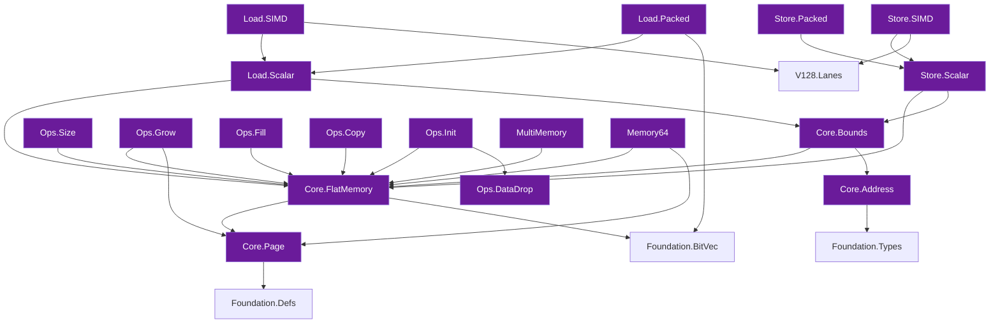
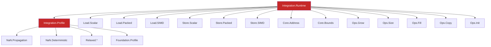
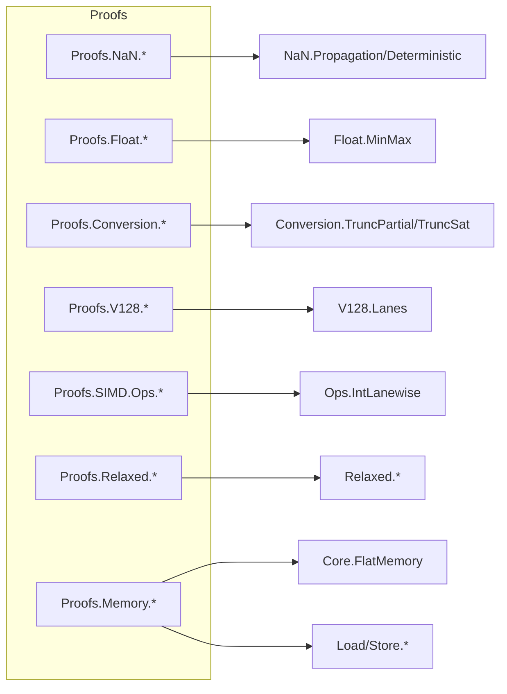

# Module Dependency Graph

> **Audience**: Developers, Contributors

This document shows the import relationships between all modules in wasm-num.

## High-Level Layer Dependencies

## Foundation Module Graph

## Numerics Module Graph

```mermaid
graph TD
    NP["NaN.Propagation"] --> WF["Foundation.WasmFloat"]
    ND["NaN.Deterministic"] --> NP
    ND --> Profile["Foundation.Profile"]

    FMM["Float.MinMax"] --> NP
    FR["Float.Rounding"] --> NP
    FS["Float.Sign"] --> Types["Foundation.Types"]
    FC["Float.Compare"] --> WF
    FP["Float.PseudoMinMax"] --> WF

    IA["Integer.Arithmetic"] --> Types
    IB["Integer.Bitwise"] --> Types
    IS["Integer.Shift"] --> Types
    IC["Integer.Compare"] --> Types
    IBi["Integer.Bits"] --> Types
    IE["Integer.Ext"] --> Types
    ISat["Integer.Saturating"] --> Types
    IMM["Integer.MinMax"] --> Types
    IMisc["Integer.Misc"] --> Types
    IBs["Integer.Bitselect"] --> Types

    TP["Conversion.TruncPartial"] --> WF
    TS["Conversion.TruncSat"] --> WF
    PD["Conversion.PromoteDemote"] --> NP
    CIF["Conversion.ConvertIntFloat"] --> WF
    RI["Conversion.Reinterpret"] --> Types
    IW["Conversion.IntWidth"] --> Types

    style NP fill:#2E7D32,color:white
    style ND fill:#2E7D32,color:white
    style FMM fill:#2E7D32,color:white
    style FR fill:#2E7D32,color:white
    style FS fill:#2E7D32,color:white
    style FC fill:#2E7D32,color:white
    style FP fill:#2E7D32,color:white
    style IA fill:#2E7D32,color:white
    style IB fill:#2E7D32,color:white
    style IS fill:#2E7D32,color:white
    style IC fill:#2E7D32,color:white
    style IBi fill:#2E7D32,color:white
    style IE fill:#2E7D32,color:white
    style ISat fill:#2E7D32,color:white
    style IMM fill:#2E7D32,color:white
    style IMisc fill:#2E7D32,color:white
    style IBs fill:#2E7D32,color:white
    style TP fill:#2E7D32,color:white
    style TS fill:#2E7D32,color:white
    style PD fill:#2E7D32,color:white
    style CIF fill:#2E7D32,color:white
    style RI fill:#2E7D32,color:white
    style IW fill:#2E7D32,color:white
```

## SIMD Module Graph

## Memory Module Graph

## Integration Module Graph

## Proof Module Dependencies

Proof modules mirror the definition hierarchy and import both the definition module being proved and Mathlib tactics:

## Related Documents

- [Architecture Overview](README.md)
- [Components](components.md)
- [Data Model](data-model.md)
- [Project Structure](../development/project-structure.md)
