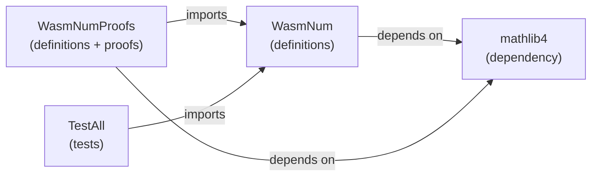

# Build System

> **Audience**: Contributors

## Overview

wasm-num uses **Lake**, Lean 4's build system and package manager. Configuration lives in `lakefile.toml`.

## Build Targets

| Target | Command | Root File | Description |
|--------|---------|-----------|-------------|
| `WasmNum` | `lake build WasmNum` | `WasmNum.lean` | Core definitions only |
| `WasmNumProofs` | `lake build WasmNumProofs` | `WasmNumProofs.lean` | Definitions + all proofs |
| `TestAll` | `lake build TestAll` | `TestAll.lean` | Full test suite (414 tests) |



## Build Commands

```bash
# Build specific target
lake build WasmNum
lake build WasmNumProofs
lake build TestAll

# Build everything
lake build

# Clean build artifacts
lake clean

# Update dependencies
lake update

# Fetch Mathlib cache
lake exe cache get
```

## Lean Options

Set in `lakefile.toml`:

| Option | Value | Effect |
|--------|-------|--------|
| `autoImplicit` | `false` | All variables must be explicitly declared |
| `relaxedAutoImplicit` | `false` | Companion to autoImplicit |

## Build Artifacts

Lake stores compiled `.olean` files in `.lake/build/`. This directory is gitignored.

| Path | Contents |
|------|----------|
| `.lake/build/lib/` | Compiled `.olean` files |
| `.lake/packages/` | Downloaded dependency sources |
| `lake-manifest.json` | Dependency lock (committed) |

## Parallelism

Lake builds modules in parallel. Control with:

```bash
LAKE_WORKERS=4 lake build WasmNum
```

Default: number of CPU cores.

## See Also

- [Dev Setup](setup.md) — initial environment setup
- [Configuration Reference](../reference/configuration.md) — all config options
- [CI/CD](ci-cd.md) — automated builds
