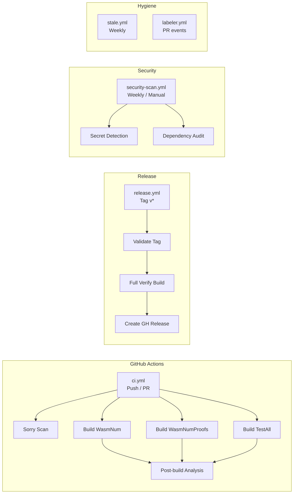

# CI/CD Pipeline

> **Audience**: Contributors, Maintainers

wasm-num uses dual CI/CD: **GitHub Actions** (primary) and **GitLab CI** (mirror).

## Pipeline Overview

## GitHub Actions Workflows

### ci.yml — Formal Verification Pipeline

**Triggers**: Push (all branches), PR (opened/sync/reopen), manual dispatch

| Stage | Job | Description |
|-------|-----|-------------|
| Pre-flight | sorry-scan | Grep for `sorry` in library sources (excluding Proofs/) |
| Build | build-definitions | `lake build WasmNum` |
| Build | build-proofs | `lake build WasmNumProofs` |
| Build | build-tests | `lake build TestAll` |
| Analysis | Post-build analysis | Axiom audit, proof metrics |

**Runner**: Self-hosted ARC (Actions Runner Controller) on Kubernetes (`arc-runner-set-pw`)

**Path exclusions**: `docs/**`, `*.md`, `LICENSE`, `.gitignore`, Dependabot/CODEOWNERS configs

**Concurrency**: One run per ref; in-progress PR runs are cancelled on new push.

### release.yml — Create Verified Release

**Triggers**: Push tag matching `v[0-9]+.[0-9]+.[0-9]+*`, manual dispatch

| Stage | Description |
|-------|-------------|
| Validate tag | Parse `vMAJOR.MINOR.PATCH[-prerelease]` format |
| Full verification build | Build all 3 targets (WasmNum, WasmNumProofs, TestAll) |
| Create release | GitHub Release with notes and artifacts |

### security-scan.yml — Security Scanning

**Triggers**: Weekly (Monday 03:00 UTC), manual dispatch

| Check | Description |
|-------|-------------|
| Secret detection | Scan working tree + last 100 commits for AWS keys, private keys, tokens, API keys |
| Dependency audit | Audit `lake-manifest.json` dependencies |

### labeler.yml — Auto-label PRs

Labels PRs based on changed file paths (configured in `.github/labeler.yml`).

### stale.yml — Stale Issue/PR Management

| Setting | Value |
|---------|-------|
| Days before stale | 60 |
| Days before close | 14 |
| Exempt labels | `pinned`, `security`, `good first issue`, `help wanted`, `work-in-progress` |

## GitLab CI Pipeline

**File**: `.gitlab-ci.yml`

**Runner**: Shell executor, tag `normal`

| Stage | Description |
|-------|-------------|
| validate | Source linting, sorry detection, config validation |
| build | Build WasmNum, WasmNumProofs, TestAll |
| test | Execute test suite, post-build verification |
| analyze | Axiom audit, proof metrics, build analysis |
| security | Secret detection, dependency audit, license check |
| release | Tag-based release automation |

**Caching**: Packages cached by `lean-toolchain` + `lake-manifest.json` key. Build artifacts cached by branch.

**Auto-cancel**: New commits on the same branch cancel in-progress pipelines.

## Permissions Model

All GitHub workflows use least-privilege `contents: read`. Only stale.yml and labeler.yml request write permissions (issues/PRs).

## See Also

- [Build](build.md) — build targets and commands
- [Release](release.md) — release process
- [Dev Setup](setup.md) — local development
