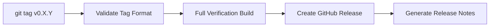

# Release Process

> **Audience**: Maintainers

## Versioning

wasm-num follows [Semantic Versioning](https://semver.org/):

- **MAJOR**: Breaking changes to public API
- **MINOR**: New features, backward-compatible
- **PATCH**: Bug fixes, backward-compatible

Current version: **0.1.0** (initial release — API may change before 1.0).

## Release Checklist

1. Ensure all CI checks pass on `main`
2. Update `version` in `lakefile.toml`
3. Update `CHANGELOG.md` with release notes
4. Commit: `git commit -m "chore: release v0.X.Y"`
5. Tag: `git tag v0.X.Y`
6. Push: `git push origin main --tags`

## Automated Release

Pushing a tag matching `v[0-9]+.[0-9]+.[0-9]+*` triggers `release.yml`:



| Step | Description |
|------|-------------|
| Validate tag | Parse semver format, detect pre-release (`-rc`, `-alpha`, etc.) |
| Full build | Build WasmNum + WasmNumProofs + TestAll |
| Create release | GitHub Release with auto-generated notes |

## CHANGELOG Convention

Follow [Keep a Changelog](https://keepachangelog.com/):

```markdown
## [0.X.Y] — YYYY-MM-DD

### Added
- New feature

### Changed
- Modified behavior

### Fixed
- Bug fix
```

## See Also

- [CI/CD](ci-cd.md) — pipeline details
- [CHANGELOG](../../CHANGELOG.md) — version history
