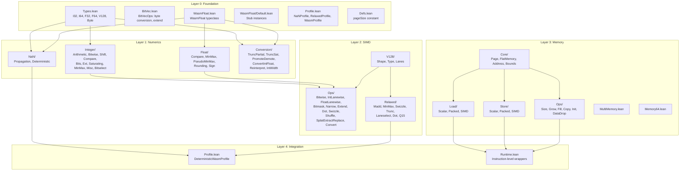

# Project Structure

> **Audience**: Contributors

Annotated directory tree for the wasm-num codebase.

## Top-Level

```
wasm-num/
├── README.md                   # Project overview & quick start
├── CHANGELOG.md                # Version history
├── CONTRIBUTING.md             # Contribution guidelines
├── CODE_OF_CONDUCT.md          # Community standards
├── SECURITY.md                 # Security policy
├── LICENSE                     # Apache 2.0
├── NOTICE                      # Copyright notice
├── TODO.md                     # Project roadmap (phases)
│
├── lakefile.toml               # Lake build config (targets, deps, options)
├── lean-toolchain              # Lean version pin (v4.29.0-rc6)
├── lake-manifest.json          # Dependency lock (auto-generated)
│
├── WasmNum.lean                # Root import — all definitions
├── WasmNumProofs.lean          # Root import — definitions + proofs
├── TestAll.lean                # Root import — test suite
│
├── WasmNum/                    # Source: definitions
├── Proofs/                     # Source: standalone proofs
├── WasmTest/                   # Source: test suite
├── docs/                       # Documentation
│
├── .github/                    # GitHub config (Actions, templates, etc.)
└── .gitlab-ci.yml              # GitLab CI config
```

## WasmNum/ — Definitions



### WasmNum/ File Tree

```
WasmNum/
├── Foundation.lean               # Re-exports all Foundation modules
├── Foundation/
│   ├── Types.lean                # Type aliases: I32, I64, F32, F64, V128, Byte, Addr32/64
│   ├── BitVec.lean               # BitVecOps: getByte, toLittleEndian, fromLittleEndian, etc.
│   ├── WasmFloat.lean            # WasmFloat typeclass (IEEE 754 abstraction)
│   ├── WasmFloat/
│   │   └── Default.lean          # Default WasmFloat 32/64 stub instances
│   ├── Profile.lean              # NaNProfile, RelaxedProfile, WasmProfile structures
│   └── Defs.lean                 # pageSize = 65536
│
├── Numerics/
│   ├── NaN/
│   │   ├── Propagation.lean      # nansN, propagateNaN₁, propagateNaN₂
│   │   └── Deterministic.lean    # DeterministicWasmProfile, propagateNaN₁_det/₂_det
│   ├── Float/
│   │   ├── Compare.lean          # feq, fne, flt, fgt, fle, fge
│   │   ├── MinMax.lean           # fmin, fmax (Set-returning)
│   │   ├── PseudoMinMax.lean     # fpmin, fpmax (deterministic)
│   │   ├── Rounding.lean         # fnearest, fceil, ffloor, ftrunc
│   │   └── Sign.lean             # fabs, fneg, fcopysign
│   ├── Integer/
│   │   ├── Arithmetic.lean       # iadd, isub, imul, idiv_u/s, irem_u/s
│   │   ├── Bitwise.lean          # iand, ior, ixor, inot, iandnot
│   │   ├── Shift.lean            # ishl, ishr_u/s, irotl, irotr
│   │   ├── Compare.lean          # ieqz, ieq, ine, ilt/gt/le/ge (u/s)
│   │   ├── Bits.lean             # iclz, ictz, ipopcnt
│   │   ├── Ext.lean              # iextend_s
│   │   ├── Saturating.lean       # sat_s/u, iadd_sat_s/u, isub_sat_s/u
│   │   ├── MinMax.lean           # imin/imax (u/s)
│   │   ├── Misc.lean             # iabs, ineg, iavgr_u, iq15mulr_sat_s
│   │   └── Bitselect.lean        # ibitselect
│   └── Conversion/
│       ├── TruncPartial.lean     # Trapping trunc (Option)
│       ├── TruncSat.lean         # Saturating trunc
│       ├── PromoteDemote.lean    # f32↔f64
│       ├── ConvertIntFloat.lean  # int→float
│       ├── Reinterpret.lean      # Bit-pattern reinterpretation
│       └── IntWidth.lean         # i32↔i64 width conversions
│
├── SIMD/
│   ├── V128/                     # (Shape.lean, Type.lean, Lanes.lean)
│   ├── Ops/                      # (11 files: Bitwise, IntLanewise, FloatLanewise, etc.)
│   └── Relaxed/                  # (7 files: Madd, MinMax, Swizzle, Trunc, Laneselect, Dot, Q15)
│
├── Memory/
│   ├── Core/                     # Page, FlatMemory, Address, Bounds
│   ├── Load/                     # Scalar, Packed, SIMD
│   ├── Store/                    # Scalar, Packed, SIMD
│   ├── Ops/                      # Size, Grow, Fill, Copy, Init, DataDrop
│   ├── MultiMemory.lean          # Multi-memory support
│   └── Memory64.lean             # 64-bit address space
│
├── Integration/
│   ├── Profile.lean              # DeterministicWasmProfile
│   └── Runtime.lean              # Instruction-level wrappers
│
└── Proofs/                       # Proofs co-located with definitions
    ├── Memory/                   # Memory proofs (Bounds, Copy, Fill, Grow, LoadStore)
    ├── Numerics/                 # Numeric proofs (Conversion, Float, NaN)
    └── SIMD/                     # SIMD proofs (Ops, Relaxed, V128)
```

## WasmTest/ — Test Suite

```
WasmTest/
├── Helpers.lean                  # Test utilities
├── Foundation.lean               # BitVec ops, type tests
├── Integer.lean                  # Integer operation tests
├── Float.lean                    # Float operation tests
├── Conversion.lean               # Conversion tests
├── Integration.lean              # Integration wrapper tests
├── Memory/
│   ├── Core.lean                 # FlatMemory construction, page tests
│   ├── LoadStore.lean            # Load/store round-trip tests
│   └── Ops.lean                  # Fill, copy, grow, init, data.drop tests
└── SIMD/
    ├── Core.lean                 # V128 lane extraction, shape tests
    ├── IntOps.lean               # SIMD integer op tests
    └── Misc.lean                 # Shuffle, swizzle, convert tests
```

## See Also

- [Architecture Overview](../architecture/) — system design
- [Module Dependencies](../architecture/module-dependency.md) — import graph
- [Build](build.md) — build targets
