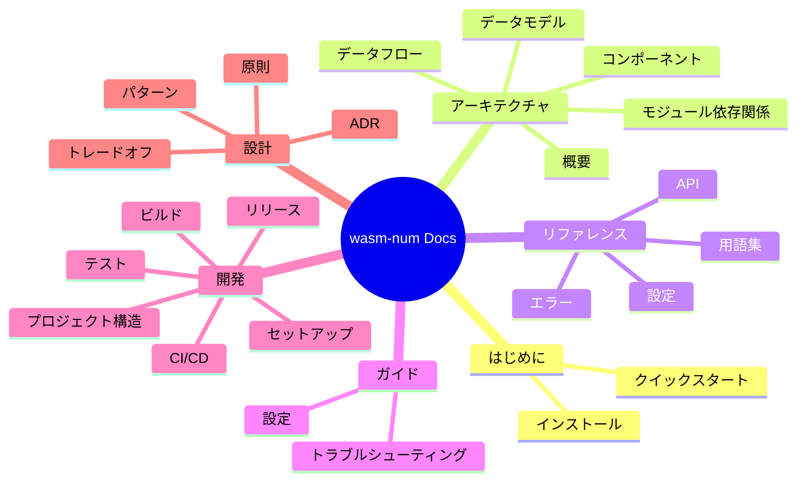

# wasm-num ドキュメント

wasm-num ドキュメントへようこそ。ここはプロジェクト全ドキュメントのナビゲーションハブです。

## クイックリンク

| やりたいこと | リンク |
|---|---|
| すぐに始めたい | [クイックスタート](getting-started/quickstart.md) |
| アーキテクチャを理解したい | [アーキテクチャ概要](architecture/) |
| API を調べたい | [API リファレンス](reference/api/) |
| プロジェクトの設定を知りたい | [設定ガイド](guides/configuration.md) |
| 開発環境をセットアップしたい | [開発環境構築](development/setup.md) |
| 設計判断を理解したい | [ADR](design/adr/) |

## ドキュメントマップ

## 全ドキュメント一覧

### はじめに

| ドキュメント | 対象者 | 説明 |
|----------|----------|-------------|
| [インストール](getting-started/installation.md) | ユーザー | すべてのインストール方法 |
| [クイックスタート](getting-started/quickstart.md) | ユーザー | 5分で動かす |

### アーキテクチャ

| ドキュメント | 対象者 | 説明 |
|----------|----------|-------------|
| [概要](architecture/) | 全員 | レイヤー図付きシステム設計全体像 |
| [コンポーネント](architecture/components.md) | 開発者 | レイヤー別の内部コンポーネント詳細 |
| [データモデル](architecture/data-model.md) | 開発者 | コア型・構造体・関係性 |
| [データフロー](architecture/data-flow.md) | 開発者 | システム内のデータの流れ |
| [モジュール依存関係](architecture/module-dependency.md) | 開発者 | モジュール依存関係グラフ |

### リファレンス

| ドキュメント | 対象者 | 説明 |
|----------|----------|-------------|
| [API 概要](reference/api/) | 開発者 | レイヤー別の完全な API ドキュメント |
| [Foundation API](reference/api/foundation.md) | 開発者 | 型、BitVec、WasmFloat、プロファイル |
| [Numerics API](reference/api/numerics.md) | 開発者 | NaN、浮動小数点、整数、変換操作 |
| [SIMD API](reference/api/simd.md) | 開発者 | V128、シェイプ、レーン演算、Relaxed SIMD |
| [Memory API](reference/api/memory.md) | 開発者 | FlatMemory、ロード/ストア、メモリ操作 |
| [Integration API](reference/api/integration.md) | 開発者 | 決定的プロファイルとランタイムラッパー |
| [設定](reference/configuration.md) | ユーザー/開発者 | ビルド設定と Lean オプション |
| [エラー](reference/errors.md) | 全員 | エラー型、トラップ条件、解決方法 |
| [用語集](reference/glossary.md) | 全員 | ドメイン用語と略語 |

### ガイド

| ドキュメント | 対象者 | 説明 |
|----------|----------|-------------|
| [設定](guides/configuration.md) | ユーザー/開発者 | wasm-num の設定方法 |
| [トラブルシューティング](guides/troubleshooting.md) | 全員 | よくある問題と対処法 |

### 開発

| ドキュメント | 対象者 | 説明 |
|----------|----------|-------------|
| [開発環境構築](development/setup.md) | コントリビューター | 完全な環境セットアップ |
| [ビルド](development/build.md) | コントリビューター | ビルドシステムとターゲット |
| [テスト](development/testing.md) | コントリビューター | テスト戦略と実行方法 |
| [CI/CD](development/ci-cd.md) | コントリビューター | GitHub Actions & GitLab CI パイプライン |
| [リリース](development/release.md) | メンテナー | リリースプロセスとバージョニング |
| [プロジェクト構造](development/project-structure.md) | コントリビューター | 注釈付きコードベースナビゲーション |

### 設計

| ドキュメント | 対象者 | 説明 |
|----------|----------|-------------|
| [設計原則](design/principles.md) | 全員 | 設計哲学とコア原則 |
| [設計パターン](design/patterns.md) | 開発者 | 使用している設計パターンとその根拠 |
| [トレードオフ](design/trade-offs.md) | 開発者/アーキテクト | 主要なトレードオフと検討した代替案 |
| [ADR 一覧](design/adr/) | 全員 | アーキテクチャ決定記録 |

## 関連ドキュメント

- [README](../../README.md) — プロジェクト概要とクイックスタート
- [CONTRIBUTING](../../CONTRIBUTING.md) — コントリビューションガイドライン
- [CHANGELOG](../../CHANGELOG.md) — バージョン履歴
- [SECURITY](../../SECURITY.md) — 脆弱性報告
- [English Version](../en/README.md) — English documentation
