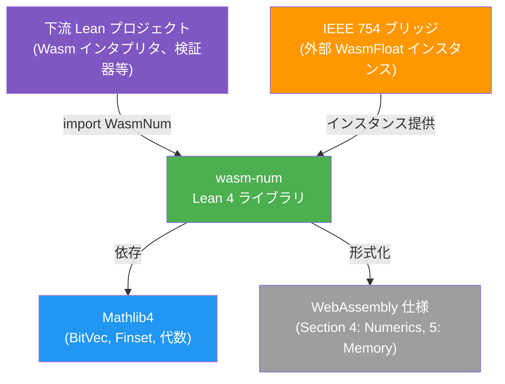
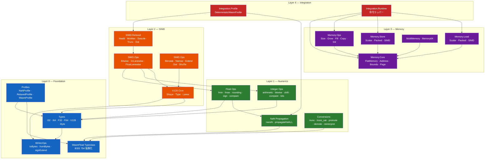

# アーキテクチャ概要

> **対象者**: 開発者、アーキテクト、コントリビューター

wasm-num は、WebAssembly 数値レイヤーの形式的に検証された Lean 4 形式化です。整数/浮動小数点演算、型変換、128ビット SIMD（Relaxed SIMD を含む）、線形メモリをカバーし、すべて機械検査済みの証明に裏付けられています。

## システムコンテキスト

wasm-num は純粋な Lean 4 ライブラリです — ランタイム、I/O、C FFI はありません。検証済み WebAssembly 数値セマンティクスを必要とする下流の Lean プロジェクトから利用されます。

## レイヤードアーキテクチャ

wasm-num は**循環依存のない**厳格なレイヤードアーキテクチャを採用しています。上位レイヤーが下位レイヤーをインポートし、その逆はありません。

## 主要な設計判断

| 決定 | 概要 | ADR |
|----------|---------|-----|
| IEEE 754 独立性 | `WasmFloat` 型クラスで特定の浮動小数点ライブラリから分離 | [ADR-001](../design/adr/0001-typeclass-mediated-754-independence.md) |
| BitVec 統一表現 | すべての数値型（`I32`、`F32`、`V128` 等）は `BitVec N` | [ADR-002](../design/adr/0002-bitvec-universal-representation.md) |
| 集合による非決定性 | 仕様レベルの非決定性を `Set α` でモデル化 | [ADR-003](../design/adr/0003-nondeterminism-as-sets.md) |
| V128 シェイプシステム | コンパイル時証明でレーン幅 × レーン数 = 128 を保証 | [ADR-004](../design/adr/0004-v128-shape-system.md) |
| パラメータ化アドレス幅 | `FlatMemory addrWidth` で Memory32 と Memory64 を統一 | [ADR-005](../design/adr/0005-flatmemory-parameterized-address-width.md) |
| 証明の分離 | 定義は `WasmNum/`、証明は `WasmNum/Proofs/` | [ADR-006](../design/adr/0006-proof-separation.md) |
| C FFI 不使用 | すべて純粋 Lean — 外部関数インターフェースなし | [ADR-007](../design/adr/0007-no-c-ffi.md) |

## コンポーネント一覧

| コンポーネント | パス | 責務 |
|-----------|----------|---------------|
| Types | `WasmNum/Foundation/Types.lean` | コア型エイリアス（`I32`、`I64`、`F32`、`F64`、`V128`、`Byte`） |
| BitVecOps | `WasmNum/Foundation/BitVec.lean` | バイト抽出、エンディアン変換、符号/ゼロ拡張 |
| WasmFloat | `WasmNum/Foundation/WasmFloat.lean` | IEEE 754 型クラス抽象化 |
| Profiles | `WasmNum/Foundation/Profile.lean` | NaN および Relaxed SIMD 非決定性セレクタ |
| NaN | `WasmNum/Numerics/NaN/` | NaN 伝搬集合と決定的特殊化 |
| Float Ops | `WasmNum/Numerics/Float/` | fmin、fmax、丸め、符号操作、比較 |
| Integer Ops | `WasmNum/Numerics/Integer/` | 算術、ビット演算、シフト、比較、飽和演算 |
| Conversions | `WasmNum/Numerics/Conversion/` | trunc、trunc_sat、promote、demote、reinterpret、extend |
| V128 Core | `WasmNum/SIMD/V128/` | シェイプシステム、レーンアクセス、splat、mapLanes、zipLanes |
| SIMD Ops | `WasmNum/SIMD/Ops/` | ビット演算、整数/浮動小数点レーン演算、bitmask、narrow、extend、dot |
| Relaxed SIMD | `WasmNum/SIMD/Relaxed/` | 非決定的 Relaxed SIMD 演算 |
| Memory Core | `WasmNum/Memory/Core/` | FlatMemory、ページモデル、アドレス計算、境界検査 |
| Load/Store | `WasmNum/Memory/Load/`、`Store/` | スカラー、パック、SIMD メモリアクセス |
| Memory Ops | `WasmNum/Memory/Ops/` | size、grow、fill、copy、init、data.drop |
| MultiMemory | `WasmNum/Memory/MultiMemory.lean` | 32/64ビットインスタンスを持つマルチメモリストア |
| Integration | `WasmNum/Integration/` | 決定的プロファイルと命令レベルランタイムラッパー |
| Proofs | `WasmNum/Proofs/` | 機械検査済み証明（定義と並行した階層構造） |

## 関連ドキュメント

- [コンポーネント詳細](components.md)
- [モジュール依存関係](module-dependency.md)
- [データモデル](data-model.md)
- [データフロー](data-flow.md)
- [設計原則](../design/principles.md)
- [API リファレンス](../reference/api/)
- [English Version](../../en/architecture/README.md)
