# コンポーネント詳細

> **対象者**: 開発者、コントリビューター

本ドキュメントでは、wasm-num の主要コンポーネントをアーキテクチャレイヤーごとに分類して解説します。

## コンポーネントアーキテクチャ

```mermaid
graph TD
    subgraph "Integration Layer"
        DWP["DeterministicWasmProfile<br/>Proof-carrying profile"]
        RT["Runtime<br/>Instruction wrappers"]
    end

    subgraph "Memory Layer"
        subgraph "Memory Core"
            FM["FlatMemory<br/>ByteArray + invariants"]
            Page["Page Model<br/>pageSize · maxPages"]
            Addr["Address<br/>effectiveAddr"]
            Bnd["Bounds<br/>inBounds · inBoundsB"]
        end
        subgraph "Memory Access"
            LSc["Load.Scalar<br/>i32Load · i64Load · f32Load · f64Load"]
            LPk["Load.Packed<br/>i32Load8S/U · i64Load32S/U ..."]
            LSi["Load.SIMD<br/>v128Load · loadSplat · loadLane"]
            SSc["Store.Scalar<br/>i32Store · i64Store ..."]
            SPk["Store.Packed<br/>i32Store8 · i64Store32 ..."]
            SSi["Store.SIMD<br/>v128Store · storeLane"]
        end
        subgraph "Memory Operations"
            Size["Size<br/>memorySize"]
            Grow["Grow<br/>growSpec · GrowthPolicy"]
            Fill["Fill<br/>memory.fill"]
            Copy["Copy<br/>memory.copy (overlap-safe)"]
            Init["Init<br/>memory.init"]
            DD["DataDrop<br/>DataSegment"]
        end
        MM["MultiMemory<br/>MemoryStore · MemoryInstance"]
        M64["Memory64<br/>64-bit address support"]
    end

    subgraph "SIMD Layer"
        subgraph "V128 Core"
            Shape["Shape<br/>laneWidth × laneCount = 128"]
            V128T["V128 Type<br/>BitVec 128"]
            Lanes["Lanes<br/>lane · replaceLane · ofLanes · splat"]
        end
        subgraph "SIMD Operations"
            BW["Bitwise<br/>v128.not · and · or · xor · bitselect"]
            IL["IntLanewise<br/>add · sub · mul · shift · compare"]
            FL["FloatLanewise<br/>fadd · fmul · fmin · fmax (Set)"]
            BM["Bitmask<br/>allTrue · bitmask"]
            NR["Narrow · Extend<br/>narrowS/U · extendLow/High"]
            Dot["Dot · Swizzle · Shuffle"]
            SE["SplatExtractReplace"]
            CV["Convert<br/>SIMD conversions"]
        end
        subgraph "Relaxed SIMD"
            RM["Madd · Nmadd<br/>relaxed FMA"]
            RMM["MinMax<br/>relaxed min/max"]
            RSw["Swizzle · Trunc"]
            RLS["Laneselect · Dot · Q15"]
        end
    end

    subgraph "Numerics Layer"
        subgraph "NaN"
            NP["Propagation<br/>nansN · propagateNaN₁/₂"]
            ND["Deterministic<br/>propagateNaN₁/₂_det"]
        end
        subgraph "Float"
            FMM["MinMax<br/>fmin · fmax (Set)"]
            FR["Rounding<br/>fnearest · fceil · ffloor · ftrunc"]
            FS["Sign<br/>fabs · fneg · fcopysign"]
            FC["Compare<br/>feq · flt · fgt · fle · fge · fne"]
            FP["PseudoMinMax<br/>fpmin · fpmax"]
        end
        subgraph "Integer"
            IA["Arithmetic<br/>iadd · isub · imul · idiv · irem"]
            IBW["Bitwise<br/>iand · ior · ixor · inot · iandnot"]
            IS["Shift<br/>ishl · ishr_u/s · irotl · irotr"]
            IC["Compare<br/>ieqz · ieq · ilt · igt · ile · ige"]
            IB["Bits<br/>iclz · ictz · ipopcnt"]
            IE["Ext · Saturating · MinMax · Misc"]
        end
        subgraph "Conversion"
            TP["TruncPartial<br/>trunc (trapping)"]
            TS["TruncSat<br/>trunc_sat (saturating)"]
            PD["PromoteDemote<br/>promote · demote"]
            CIF["ConvertIntFloat<br/>convert (int→float)"]
            RI["Reinterpret<br/>identity conversions"]
            IW["IntWidth<br/>wrap · extend"]
        end
    end

    subgraph "Foundation Layer"
        Ty["Types<br/>I32 · I64 · F32 · F64 · V128 · Byte"]
        BV["BitVecOps<br/>toBytes · fromBytes · signExtend"]
        WF["WasmFloat Typeclass<br/>IEEE 754 abstraction"]
        Prof["Profiles<br/>NaNProfile · RelaxedProfile · WasmProfile"]
    end

    DWP --> NP
    DWP --> RM
    RT --> LSc
    RT --> SSc
    RT --> Grow

    LSc --> FM
    LSc --> Bnd
    LPk --> FM
    LSi --> FM
    SSc --> FM
    SPk --> FM
    SSi --> FM
    Fill --> FM
    Copy --> FM
    Init --> FM
    Grow --> FM
    Size --> FM
    MM --> FM

    IL --> Lanes
    FL --> Lanes
    BW --> V128T
    NR --> Lanes
    Dot --> Lanes
    RM --> FL
    RMM --> FL

    NP --> WF
    FMM --> NP
    FC --> WF
    TP --> WF
    TS --> WF
    PD --> WF
    CIF --> WF
    IA --> Ty
    Shape --> Ty

    style Ty fill:#1565C0,color:white
    style BV fill:#1565C0,color:white
    style WF fill:#1565C0,color:white
    style Prof fill:#1565C0,color:white
```

## Layer 0: Foundation

### Types (`WasmNum/Foundation/Types.lean`)

すべての WebAssembly 数値型は `BitVec N` のエイリアスです:

| 型 | 定義 | Wasm 型 |
|----|------|---------|
| `I32` | `BitVec 32` | `i32` — 32ビット整数型 |
| `I64` | `BitVec 64` | `i64` — 64ビット整数型 |
| `F32` | `BitVec 32` | `f32` — 32ビット浮動小数点型（ビットパターン） |
| `F64` | `BitVec 64` | `f64` — 64ビット浮動小数点型（ビットパターン） |
| `V128` | `BitVec 128` | `v128` — 128ビット SIMD ベクトル型 |
| `Byte` | `BitVec 8` | byte — 8ビット値 |
| `Addr32` | `BitVec 32` | Memory32 アドレス |
| `Addr64` | `BitVec 64` | Memory64 アドレス |

これは ADR-002 に基づく設計です。`BitVec N` を統一的な表現として使用することで、整数と浮動小数点の表現間の変換オーバーヘッドが排除されます（同じ基底ビットを共有するため）。

### BitVecOps (`WasmNum/Foundation/BitVec.lean`)

名前空間 `BitVecOps` 内の WebAssembly 固有 BitVec 拡張:

- `getByte` — i番目のバイトを抽出（リトルエンディアン、LSB = バイト0）
- `toLittleEndian` / `fromLittleEndian` — `Vector Byte` としてリトルエンディアンで分解/再構成
- `toBytes` / `fromBytes` — エイリアス（Wasm は常にリトルエンディアン）
- `signExtend` / `zeroExtend` — 幅拡張（幅制約の証明付き）
- `extractBits` — ビット範囲を抽出
- `concat` — `BitVec.append` のラッパー

### WasmFloat (`WasmNum/Foundation/WasmFloat.lean`)

`WasmFloat N` 型クラスは、任意の IEEE 754 実装を抽象化します（ADR-001）。以下を定義します:

- **分類**: `isNaN`, `isInfinite`, `isZero`, `isNegative`, `isSubnormal`, `isCanonicalNaN`, `isArithmeticNaN`
- **算術演算**: `add`, `sub`, `mul`, `div`, `sqrt`, `fma`（最近接偶数丸め）
- **丸めプリミティブ**: `nearestInt`, `ceilInt`, `floorInt`, `truncInt`
- **比較**: `lt`, `le`, `eq`（NaN は順序なし比較; +0 == -0）
- **変換**: `truncToInt`, `truncToNat`, `convertFromInt`, `convertFromNat`
- **構造的証明**: `isNaN_canonicalNaN`, `isCanonicalNaN_isNaN`, `isArithmeticNaN_isNaN`

関連する型クラス: `WasmFloatPromote`（f32 → f64、正確）と `WasmFloatDemote`（f64 → f32、丸めの可能性あり）。

テスト用スタブ `WasmFloat/Default.lean` は、正しい分類を持つが算術はプレースホルダー（canonicalNaN を返す）のインスタンスを提供します。

### Profiles (`WasmNum/Foundation/Profile.lean`)

非決定的な動作をパラメータ化する構造体:

- **`NaNProfile`** — 有効な NaN を返すことの証明付き `selectNaN` セレクタ
- **`RelaxedProfile`** — すべての Relaxed SIMD 演算の決定的実装
- **`WasmProfile`** — `NaNProfile + RelaxedProfile` をバンドル

## Layer 1: Numerics

### NaN 伝搬 (`WasmNum/Numerics/NaN/`)

Wasm 仕様の `nans_N{z*}` 記法を実装:

- `nans N` — ビット幅 N のすべての NaN 値
- `canonicalNans N` — 正規 NaN 集合 (±)
- `arithmeticNans N` — quiet NaN 集合
- `nansN N inputs` — 入力オペランドに対して仕様が許容する NaN 結果
- `propagateNaN₁` / `propagateNaN₂` — `Set` を返す単項/二項 NaN 伝搬
- `propagateNaN₁_det` / `propagateNaN₂_det` — `NaNProfile` を使用した決定的バリアント

### 浮動小数点演算 (`WasmNum/Numerics/Float/`)

| モジュール | 関数 | 戻り値 |
|-----------|------|--------|
| MinMax | `fmin`, `fmax` | `Set`（NaN 非決定性） |
| Rounding | `fnearest`, `fceil`, `ffloor`, `ftrunc` | `Set` |
| Sign | `fabs`, `fneg`, `fcopysign` | 決定的 `BitVec N` |
| Compare | `feq`, `fne`, `flt`, `fgt`, `fle`, `fge` | `I32`（0 または 1） |
| PseudoMinMax | `fpmin`, `fpmax` | 決定的 `BitVec N` |

### 整数演算 (`WasmNum/Numerics/Integer/`)

| モジュール | 関数 |
|-----------|------|
| Arithmetic | `iadd`, `isub`, `imul`, `idiv_u/s` (Option), `irem_u/s` (Option) |
| Bitwise | `iand`, `ior`, `ixor`, `inot`, `iandnot` |
| Shift | `ishl`, `ishr_u`, `ishr_s`, `irotl`, `irotr` |
| Compare | `ieqz`, `ieq`, `ine`, `ilt_u/s`, `igt_u/s`, `ile_u/s`, `ige_u/s` |
| Bits | `iclz`, `ictz`, `ipopcnt` |
| Ext | `iextend_s`（サブ幅の符号拡張） |
| Saturating | `sat_s/u`, `iadd_sat_s/u`, `isub_sat_s/u` |
| MinMax | `imin_u/s`, `imax_u/s` |
| Misc | `iabs`, `ineg`, `iavgr_u`, `iq15mulr_sat_s` |
| Bitselect | `ibitselect` |

### 変換 (`WasmNum/Numerics/Conversion/`)

| モジュール | 関数 | 動作 |
|-----------|------|------|
| TruncPartial | `truncToIntS/U`, 8つの具体的バリアント | `Option` — NaN/Inf/オーバーフロー時に `none` |
| TruncSat | `truncSatToIntS/U`, 8つの具体的バリアント | 飽和演算 — NaN→0、範囲にクランプ |
| PromoteDemote | `promoteF32`, `demoteF64` | `Set`（NaN 処理） |
| ConvertIntFloat | 8つの `convert*` バリアント | 決定的（最近接偶数丸め） |
| Reinterpret | 4つの `reinterpret*` バリアント | 恒等変換（BitVec = BitVec） |
| IntWidth | `wrapI64`, `extendI32S/U`, サブ幅拡張 | 決定的ビット操作 |

## Layer 2: SIMD

### V128 コア (`WasmNum/SIMD/V128/`)

- **Shape** — `laneWidth × laneCount = 128`（証明付き）。6つの具体的シェイプ: `i8x16`, `i16x8`, `i32x4`, `i64x2`, `f32x4`, `f64x2`
- **Type** — `V128 := BitVec 128`
- **Lanes** — `lane`, `replaceLane`, `ofLanes`, `splat`, `mapLanes`, `zipLanes`, 定数（`V128.zero`, `V128.allOnes`）

### SIMD Ops (`WasmNum/SIMD/Ops/`)

| モジュール | 演算 |
|-----------|------|
| Bitwise | `v128_not/and/andnot/or/xor/bitselect/any_true`, `boolToMask` |
| IntLanewise | 算術、飽和演算、min/max、シフト、比較、abs、avgRU、popcnt、q15mulrSatS |
| FloatLanewise | `fadd/fsub/fmul/fdiv/fsqrt` (Set)、fmin/fmax (Set)、pmin/pmax、丸め (Set)、abs/neg、比較 |
| Bitmask | `allTrue`, `bitmask` |
| Narrow | `narrowS/U`（飽和） |
| Extend | `extendLow/HighS/U`, `extAddPairwiseS/U`, `extMulS/U` |
| Dot | `dot_i16x8_i32x4` |
| Swizzle | `swizzle`（インデックスによるレーン選択） |
| Shuffle | `shuffle`（2つの V128 ベクトルから） |
| SplatExtractReplace | シェイプごとの splat, extractLane, replaceLane |
| Convert | `convertI32x4`, `truncSatF32x4S/U`, `truncSatF64x2S/U`, `promoteF32x4`, `demoteF64x2` |

### Relaxed SIMD (`WasmNum/SIMD/Relaxed/`)

すべて `Set V128` を返す — 仕様は非決定的結果を許容:

| モジュール | 演算 |
|-----------|------|
| Madd | `madd`, `nmadd`（fused multiply-add） |
| MinMax | `min`, `max`（relaxed 浮動小数点 min/max） |
| Swizzle | `swizzle`（範囲外はゼロ化またはサチュレーション） |
| Trunc | `truncF32x4S/U`, `truncF64x2SZero/UZero` |
| Laneselect | `laneselect`（MSB ベースまたはビット単位選択） |
| Dot | `dot_i8x16_i7x16_s`, `dot_i8x16_i7x16_add_s` |
| Q15 | `q15mulrS` |

## Layer 3: Memory

### Memory コア (`WasmNum/Memory/Core/`)

- **Page** — `pageSize = 65536`, `maxPages 32 = 65536`, `maxPages 64 = 2^48` のページモデル
- **FlatMemory** — `data : ByteArray` + `pageCount` + `maxLimit` + 4つの不変条件
- **Address** — `effectiveAddr`（オーバーフロー検査付きの base + offset → `Option`）
- **Bounds** — `inBounds`（述語）、`inBoundsB`（決定可能）、`effectiveInBounds`

### Load/Store (`WasmNum/Memory/Load/`, `Store/`)

スカラーロード（i32/i64/f32/f64）、符号/ゼロ拡張付きパックドロード（8/16/32ビットのサブ幅）、SIMD ロード（v128, splat, lane, extend）、および対応するストア。

### Memory 演算 (`WasmNum/Memory/Ops/`)

- `memorySize` — 現在のページ数
- `growSpec` — `Set GrowResult` を返す（非決定的）; 決定的なインスタンス化のための `GrowthPolicy` 型クラス
- `fill` — 値でバイトを埋める、範囲外の場合トラップ
- `copy` — オーバーラップ安全コピー（方向を自動選択）
- `init` — データセグメントからメモリへコピー
- `dataDrop` / `DataSegment` — データセグメントの破棄

### MultiMemory (`WasmNum/Memory/MultiMemory.lean`)

`MemoryStore` — `MemoryInstance`（`mem32` または `mem64`）の配列、インデックスアクセス。

## Layer 4: Integration

### DeterministicWasmProfile (`WasmNum/Integration/Profile.lean`)

`WasmProfile` を拡張し、すべての決定的選択が仕様で許容される集合に属することの証明を付加します。各 Relaxed SIMD 演算と NaN 選択にメンバーシップ証明が付きます。

### Runtime (`WasmNum/Integration/Runtime.lean`)

以下を組み合わせた決定的な命令レベルのラッパー:
1. 実効アドレス計算
2. 境界検査
3. ロード/ストア実行

すべてのスカラー/パックド/SIMD ロード・ストア命令および memory.grow/size/fill/copy/init をカバーします。

## 証明

| コンポーネント | 証明モジュール | 主要な結果 |
|--------------|---------------|-----------|
| NaN | Propagation, Deterministic | NaN 伝搬の正しさ、決定的シングルトン |
| Float | MinMax | fmin/fmax の仕様準拠 |
| Conversion | TruncPartial, TruncSat | 範囲の正しさ、飽和の正しさ |
| V128 | LanesRoundtrip, LanesBijection | レーン抽出/置換のラウンドトリップ、全単射 |
| SIMD Ops | Lanewise | レーン単位演算 = レーンごとのスカラー演算 |
| Relaxed | DetIsSpecialCase | 決定的 ⊆ 非決定的 |
| Memory | Bounds, LoadStore, Grow, Fill, Copy | ロード・ストアのラウンドトリップ、不連続性、データ保存、オーバーラップの正しさ |

## 関連ドキュメント

- [アーキテクチャ概要](README.md)
- [モジュール依存関係](module-dependency.md)
- [データモデル](data-model.md)
- [データフロー](data-flow.md)
- [設計原則](../design/principles.md)
- [Foundation API](../reference/api/foundation.md)
- [Memory API](../reference/api/memory.md)
- [用語集](../reference/glossary.md)
- [English Version](../../en/architecture/components.md)
