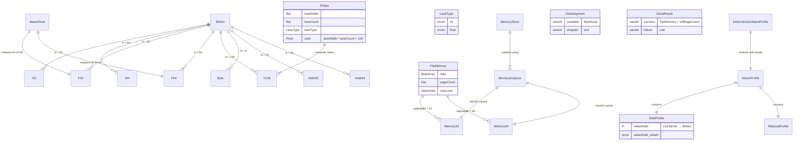
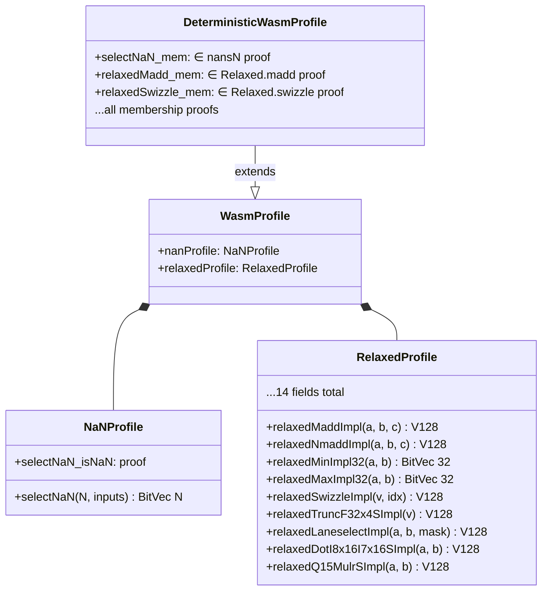
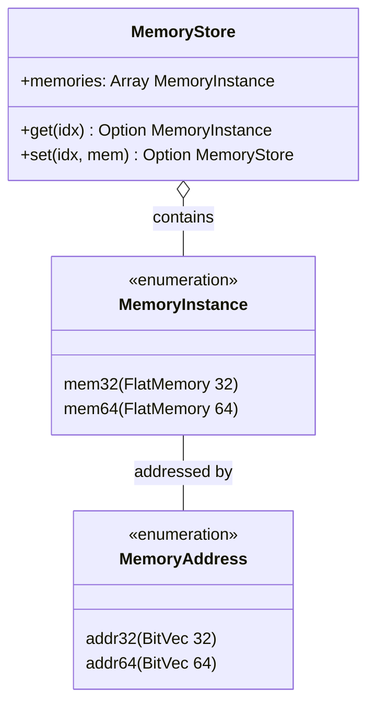

# データモデル

> **対象者**: 開発者、コントリビューター

本ドキュメントでは、wasm-num のコアデータ型、構造体、およびそれらの関係を説明します。

## 型の世界

すべての WebAssembly 数値は Mathlib の `BitVec N` として表現されます。これは ADR-002 に基づく設計です。



## コア型エイリアス

すべて `WasmNum/Foundation/Types.lean` で定義:

```lean
abbrev I32   := BitVec 32    -- WebAssembly 32-bit integer
abbrev I64   := BitVec 64    -- WebAssembly 64-bit integer
abbrev F32   := BitVec 32    -- 32-bit float (bit-pattern)
abbrev F64   := BitVec 64    -- 64-bit float (bit-pattern)
abbrev V128  := BitVec 128   -- 128-bit SIMD vector
abbrev Byte  := BitVec 8     -- 8-bit value
abbrev Addr32 := BitVec 32   -- 32-bit memory address
abbrev Addr64 := BitVec 64   -- 64-bit memory address
```

> **注:** `F32` と `I32` は**同一の型**（`BitVec 32`）です。浮動小数点か整数かの解釈は、どの操作を適用するかに依存します。これは Wasm のスタックマシンセマンティクスと一致しています。

## SIMD シェイプ

`Shape` 構造体は、型レベルの証明を伴うレーン構成を制約します:

| シェイプ | レーン幅 | レーン数 | レーン型 |
|---------|:-------:|:-------:|---------|
| `i8x16` | 8 | 16 | int |
| `i16x8` | 16 | 8 | int |
| `i32x4` | 32 | 4 | int |
| `i64x2` | 64 | 2 | int |
| `f32x4` | 32 | 4 | float |
| `f64x2` | 64 | 2 | float |

各シェイプは以下の証明を持ちます:
- `valid : laneWidth * laneCount = 128`
- `widthPow2 : ∃ k, laneWidth = 2 ^ k ∧ 3 ≤ k ∧ k ≤ 6`

## FlatMemory

アドレス幅でパラメータ化された中心的なメモリ構造体:

```lean
structure FlatMemory (addrWidth : Nat) where
  data       : ByteArray
  pageCount  : Nat
  maxLimit   : Option Nat
  -- Invariants:
  inv_dataSize : data.size = pageCount * pageSize
  inv_maxValid : ∀ max, maxLimit = some max → pageCount ≤ max
  inv_addrFits : pageCount * pageSize ≤ 2 ^ addrWidth
  inv_maxFits  : ∀ max, maxLimit = some max → max * pageSize ≤ 2 ^ addrWidth
```

| エイリアス | 定義 | 最大メモリ |
|-----------|------|-----------|
| `Memory32` | `FlatMemory 32` | 4 GiB（65536 ページ） |
| `Memory64` | `FlatMemory 64` | 16 EiB（2^48 ページ） |

不変条件の説明:
- `inv_dataSize` — データサイズがページ数 × ページサイズと一致
- `inv_maxValid` — 現在のページ数が最大制限以下
- `inv_addrFits` — メモリサイズがアドレス空間に収まる
- `inv_maxFits` — 最大制限がアドレス空間に収まる

## Profile 階層



## MultiMemory



## 関連ドキュメント

- [アーキテクチャ概要](README.md)
- [コンポーネント](components.md)
- [Foundation API](../reference/api/foundation.md)
- [Memory API](../reference/api/memory.md)
- [用語集](../reference/glossary.md)
- [English Version](../../en/architecture/data-model.md)
