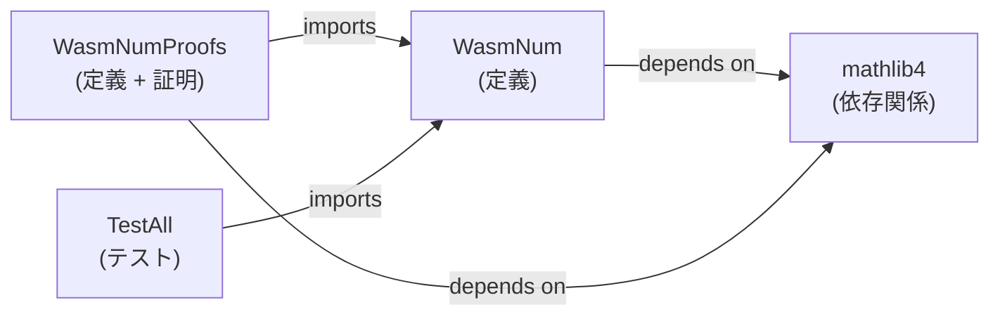

# ビルドシステム

> **対象読者**: コントリビューター

## 概要

wasm-num は Lean 4 のビルドシステム兼パッケージマネージャ **Lake** を使用。設定は `lakefile.toml` に記載。

## ビルドターゲット

| ターゲット | コマンド | ルートファイル | 説明 |
|----------|---------|------------|------|
| `WasmNum` | `lake build WasmNum` | `WasmNum.lean` | コア定義のみ |
| `WasmNumProofs` | `lake build WasmNumProofs` | `WasmNumProofs.lean` | 定義 + 全証明 |
| `TestAll` | `lake build TestAll` | `TestAll.lean` | 完全テストスイート（414テスト） |



## ビルドコマンド

```bash
# 特定ターゲットをビルド
lake build WasmNum
lake build WasmNumProofs
lake build TestAll

# すべてをビルド
lake build

# ビルド成果物をクリーン
lake clean

# 依存関係を更新
lake update

# Mathlib キャッシュを取得
lake exe cache get
```

## Lean オプション

`lakefile.toml` で設定：

| オプション | 値 | 効果 |
|----------|-----|------|
| `autoImplicit` | `false` | すべての変数を明示的に宣言する必要あり |
| `relaxedAutoImplicit` | `false` | autoImplicit の補助設定 |

## ビルド成果物

Lake はコンパイル済み `.olean` ファイルを `.lake/build/` に格納。このディレクトリは gitignore 対象。

| パス | 内容 |
|-----|------|
| `.lake/build/lib/` | コンパイル済み `.olean` ファイル |
| `.lake/packages/` | ダウンロードした依存関係ソース |
| `lake-manifest.json` | 依存関係ロック（コミット対象） |

## 並列処理

Lake はモジュールを並列ビルドします。以下で制御：

```bash
LAKE_WORKERS=4 lake build WasmNum
```

デフォルト：CPU コア数。

## 関連ドキュメント

- [開発環境セットアップ](setup.md) — 初期環境セットアップ
- [設定リファレンス](../reference/configuration.md) — すべての設定オプション
- [CI/CD](ci-cd.md) — 自動ビルド
- [English Version](../../en/development/build.md)
