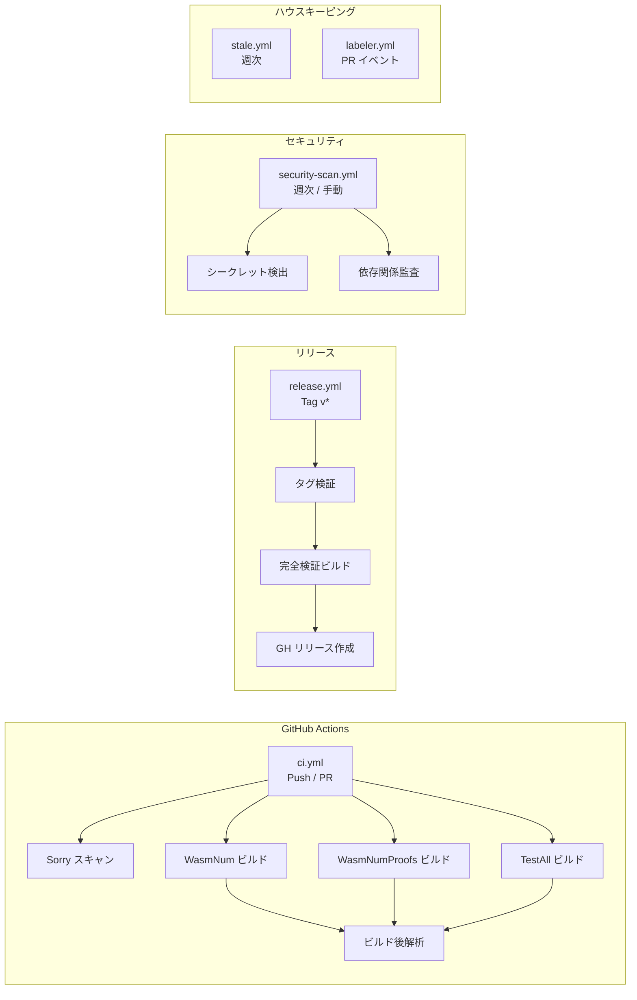

# CI/CD パイプライン

> **対象読者**: コントリビューター、メンテナー

wasm-num は **GitHub Actions**（主系）と **GitLab CI**（ミラー）のデュアル CI/CD を使用。

## パイプライン概要

## GitHub Actions ワークフロー

### ci.yml — 形式検証パイプライン

**トリガー**: Push（全ブランチ）、PR（opened/sync/reopen）、手動ディスパッチ

| ステージ | ジョブ | 説明 |
|---------|------|------|
| プリフライト | sorry-scan | ライブラリソースの `sorry` を grep（Proofs/ を除く） |
| ビルド | build-definitions | `lake build WasmNum` |
| ビルド | build-proofs | `lake build WasmNumProofs` |
| ビルド | build-tests | `lake build TestAll` |
| 解析 | ビルド後解析 | 公理監査、証明メトリクス |

**ランナー**: セルフホスト ARC（Actions Runner Controller）on Kubernetes（`arc-runner-set-pw`）

**パス除外**: `docs/**`、`*.md`、`LICENSE`、`.gitignore`、Dependabot/CODEOWNERS 設定

**並行制御**: ref ごとに1実行。新しいプッシュで進行中の PR 実行はキャンセル。

### release.yml — 検証済みリリースの作成

**トリガー**: `v[0-9]+.[0-9]+.[0-9]+*` に一致するタグのプッシュ、手動ディスパッチ

| ステージ | 説明 |
|---------|------|
| タグ検証 | `vMAJOR.MINOR.PATCH[-prerelease]` 形式のパース |
| 完全検証ビルド | 3ターゲットすべてをビルド（WasmNum、WasmNumProofs、TestAll） |
| リリース作成 | リリースノートと成果物付き GitHub Release |

### security-scan.yml — セキュリティスキャン

**トリガー**: 週次（月曜 03:00 UTC）、手動ディスパッチ

| チェック | 説明 |
|--------|------|
| シークレット検出 | ワーキングツリー + 直近100コミットで AWS キー、秘密鍵、トークン、API キーをスキャン |
| 依存関係監査 | `lake-manifest.json` の依存関係を監査 |

### labeler.yml — PR 自動ラベル

変更ファイルパスに基づいて PR にラベルを付与（`.github/labeler.yml` で設定）。

### stale.yml — Stale Issue/PR 管理

| 設定 | 値 |
|------|-----|
| Stale になるまでの日数 | 60 |
| クローズまでの日数 | 14 |
| 免除ラベル | `pinned`、`security`、`good first issue`、`help wanted`、`work-in-progress` |

## GitLab CI パイプライン

**ファイル**: `.gitlab-ci.yml`

**ランナー**: Shell エグゼキュータ、タグ `normal`

| ステージ | 説明 |
|---------|------|
| validate | ソースリンティング、sorry 検出、設定検証 |
| build | WasmNum、WasmNumProofs、TestAll をビルド |
| test | テストスイート実行、ビルド後検証 |
| analyze | 公理監査、証明メトリクス、ビルド解析 |
| security | シークレット検出、依存関係監査、ライセンスチェック |
| release | タグベースのリリース自動化 |

**キャッシュ**: `lean-toolchain` + `lake-manifest.json` キーでパッケージをキャッシュ。ブランチ別にビルド成果物をキャッシュ。

**自動キャンセル**: 同一ブランチの新しいコミットで進行中パイプラインをキャンセル。

## 権限モデル

すべての GitHub ワークフローは最小権限 `contents: read` を使用。stale.yml と labeler.yml のみ書き込み権限（issues/PRs）を要求。

## 関連ドキュメント

- [ビルド](build.md) — ビルドターゲットとコマンド
- [リリース](release.md) — リリースプロセス
- [開発環境セットアップ](setup.md) — ローカル開発
- [English Version](../../en/development/ci-cd.md)
