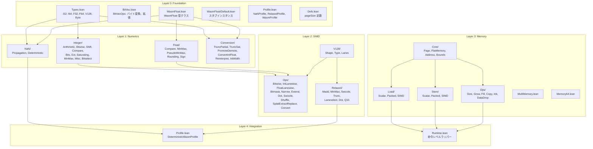

# プロジェクト構成

> **対象読者**: コントリビューター

wasm-num コードベースの注釈付きディレクトリツリー。

## トップレベル

```
wasm-num/
├── README.md                   # プロジェクト概要 & クイックスタート
├── CHANGELOG.md                # バージョン履歴
├── CONTRIBUTING.md             # コントリビューションガイドライン
├── CODE_OF_CONDUCT.md          # コミュニティ規範
├── SECURITY.md                 # セキュリティポリシー
├── LICENSE                     # Apache 2.0
├── NOTICE                      # 著作権表示
├── TODO.md                     # プロジェクトロードマップ（フェーズ別）
│
├── lakefile.toml               # Lake ビルド設定（ターゲット、依存関係、オプション）
├── lean-toolchain              # Lean バージョンピン（v4.29.0-rc6）
├── lake-manifest.json          # 依存関係ロック（自動生成）
│
├── WasmNum.lean                # ルートインポート — 全定義
├── WasmNumProofs.lean          # ルートインポート — 定義 + 証明
├── TestAll.lean                # ルートインポート — テストスイート
│
├── WasmNum/                    # ソース: 定義
├── Proofs/                     # ソース: 独立証明
├── WasmTest/                   # ソース: テストスイート
├── docs/                       # ドキュメント
│
├── .github/                    # GitHub 設定（Actions、テンプレート等）
└── .gitlab-ci.yml              # GitLab CI 設定
```

## WasmNum/ — 定義



### WasmNum/ ファイルツリー

```
WasmNum/
├── Foundation.lean               # 全 Foundation モジュールを再エクスポート
├── Foundation/
│   ├── Types.lean                # 型エイリアス: I32, I64, F32, F64, V128, Byte, Addr32/64
│   ├── BitVec.lean               # BitVecOps: getByte, toLittleEndian, fromLittleEndian 等
│   ├── WasmFloat.lean            # WasmFloat 型クラス（IEEE 754 抽象化）
│   ├── WasmFloat/
│   │   └── Default.lean          # デフォルト WasmFloat 32/64 スタブインスタンス
│   ├── Profile.lean              # NaNProfile, RelaxedProfile, WasmProfile 構造体
│   └── Defs.lean                 # pageSize = 65536
│
├── Numerics/
│   ├── NaN/
│   │   ├── Propagation.lean      # nansN, propagateNaN₁, propagateNaN₂
│   │   └── Deterministic.lean    # DeterministicWasmProfile, propagateNaN₁_det/₂_det
│   ├── Float/
│   │   ├── Compare.lean          # feq, fne, flt, fgt, fle, fge
│   │   ├── MinMax.lean           # fmin, fmax（Set 返却）
│   │   ├── PseudoMinMax.lean     # fpmin, fpmax（決定論的）
│   │   ├── Rounding.lean         # fnearest, fceil, ffloor, ftrunc
│   │   └── Sign.lean             # fabs, fneg, fcopysign
│   ├── Integer/
│   │   ├── Arithmetic.lean       # iadd, isub, imul, idiv_u/s, irem_u/s
│   │   ├── Bitwise.lean          # iand, ior, ixor, inot, iandnot
│   │   ├── Shift.lean            # ishl, ishr_u/s, irotl, irotr
│   │   ├── Compare.lean          # ieqz, ieq, ine, ilt/gt/le/ge (u/s)
│   │   ├── Bits.lean             # iclz, ictz, ipopcnt
│   │   ├── Ext.lean              # iextend_s
│   │   ├── Saturating.lean       # sat_s/u, iadd_sat_s/u, isub_sat_s/u
│   │   ├── MinMax.lean           # imin/imax (u/s)
│   │   ├── Misc.lean             # iabs, ineg, iavgr_u, iq15mulr_sat_s
│   │   └── Bitselect.lean        # ibitselect
│   └── Conversion/
│       ├── TruncPartial.lean     # トラップ trunc（Option）
│       ├── TruncSat.lean         # 飽和 trunc
│       ├── PromoteDemote.lean    # f32↔f64
│       ├── ConvertIntFloat.lean  # int→float
│       ├── Reinterpret.lean      # ビットパターン再解釈
│       └── IntWidth.lean         # i32↔i64 幅変換
│
├── SIMD/
│   ├── V128/                     # (Shape.lean, Type.lean, Lanes.lean)
│   ├── Ops/                      # (11ファイル: Bitwise, IntLanewise, FloatLanewise 等)
│   └── Relaxed/                  # (7ファイル: Madd, MinMax, Swizzle, Trunc, Laneselect, Dot, Q15)
│
├── Memory/
│   ├── Core/                     # Page, FlatMemory, Address, Bounds
│   ├── Load/                     # Scalar, Packed, SIMD
│   ├── Store/                    # Scalar, Packed, SIMD
│   ├── Ops/                      # Size, Grow, Fill, Copy, Init, DataDrop
│   ├── MultiMemory.lean          # マルチメモリサポート
│   └── Memory64.lean             # 64ビットアドレス空間
│
├── Integration/
│   ├── Profile.lean              # DeterministicWasmProfile
│   └── Runtime.lean              # 命令レベルラッパー
│
└── Proofs/                       # 定義と共存する証明
    ├── Memory/                   # メモリ証明（Bounds, Copy, Fill, Grow, LoadStore）
    ├── Numerics/                 # 数値証明（Conversion, Float, NaN）
    └── SIMD/                     # SIMD 証明（Ops, Relaxed, V128）
```

## Proofs/ — 独立証明プレースホルダー

リポジトリルートの `Proofs/` ディレクトリは、将来の独立証明用の空のプレースホルダーディレクトリ（`.gitkeep` のみ）です。現在の証明はすべて `WasmNum/Proofs/` にあります。

```
Proofs/
├── Foundation/                   # （プレースホルダー — .gitkeep のみ）
├── Integration/                  # （プレースホルダー — .gitkeep のみ）
├── Memory/
│   ├── Core/                     # （プレースホルダー — .gitkeep のみ）
│   ├── Load/                     # （プレースホルダー — .gitkeep のみ）
│   ├── Ops/                      # （プレースホルダー — .gitkeep のみ）
│   └── Store/                    # （プレースホルダー — .gitkeep のみ）
├── Numerics/
│   ├── Conversion/               # （プレースホルダー — .gitkeep のみ）
│   ├── Float/                    # （プレースホルダー — .gitkeep のみ）
│   ├── Integer/                  # （プレースホルダー — .gitkeep のみ）
│   └── NaN/                      # （プレースホルダー — .gitkeep のみ）
└── SIMD/
    ├── Ops/                      # （プレースホルダー — .gitkeep のみ）
    ├── Relaxed/                  # （プレースホルダー — .gitkeep のみ）
    └── V128/                     # （プレースホルダー — .gitkeep のみ）
```

## WasmTest/ — テストスイート

```
WasmTest/
├── Helpers.lean                  # テストユーティリティ
├── Foundation.lean               # BitVec 操作、型テスト
├── Integer.lean                  # 整数操作テスト
├── Float.lean                    # 浮動小数点操作テスト
├── Conversion.lean               # 変換テスト
├── Integration.lean              # 統合ラッパーテスト
├── Memory/
│   ├── Core.lean                 # FlatMemory 構築、ページテスト
│   ├── LoadStore.lean            # ロード/ストアラウンドトリップテスト
│   └── Ops.lean                  # Fill、Copy、Grow、Init、data.drop テスト
└── SIMD/
    ├── Core.lean                 # V128 レーン抽出、シェイプテスト
    ├── IntOps.lean               # SIMD 整数操作テスト
    └── Misc.lean                 # Shuffle、Swizzle、Convert テスト
```

## 関連ドキュメント

- [アーキテクチャ概要](../architecture/) — システム設計
- [モジュール依存関係](../architecture/module-dependency.md) — インポートグラフ
- [ビルド](build.md) — ビルドターゲット
- [English Version](../../en/development/project-structure.md)
