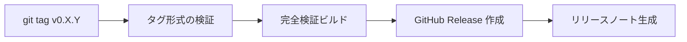

# リリースプロセス

> **対象読者**: メンテナー

## バージョニング

wasm-num は [Semantic Versioning](https://semver.org/) に準拠：

- **MAJOR**: パブリック API への後方互換性のない変更
- **MINOR**: 新機能、後方互換性あり
- **PATCH**: バグ修正、後方互換性あり

現在のバージョン: **0.1.0**（初回リリース — 1.0 以前は API が変更される可能性あり）。

## リリースチェックリスト

1. `main` で全 CI チェックがパスしていることを確認
2. `lakefile.toml` の `version` を更新
3. `CHANGELOG.md` をリリースノートで更新
4. コミット: `git commit -m "chore: release v0.X.Y"`
5. タグ: `git tag v0.X.Y`
6. プッシュ: `git push origin main --tags`

## 自動リリース

`v[0-9]+.[0-9]+.[0-9]+*` に一致するタグのプッシュで `release.yml` がトリガー：



| ステップ | 説明 |
|---------|------|
| タグ検証 | SemVer 形式のパース、プレリリース検出（`-rc`、`-alpha` 等） |
| 完全ビルド | WasmNum + WasmNumProofs + TestAll のビルド |
| リリース作成 | 自動生成ノート付き GitHub Release |

## CHANGELOG 規約

[Keep a Changelog](https://keepachangelog.com/) に準拠：

```markdown
## [0.X.Y] — YYYY-MM-DD

### Added
- 新機能

### Changed
- 変更された動作

### Fixed
- バグ修正
```

## 関連ドキュメント

- [CI/CD](ci-cd.md) — パイプラインの詳細
- [CHANGELOG](../../CHANGELOG.md) — バージョン履歴
- [English Version](../../en/development/release.md)
